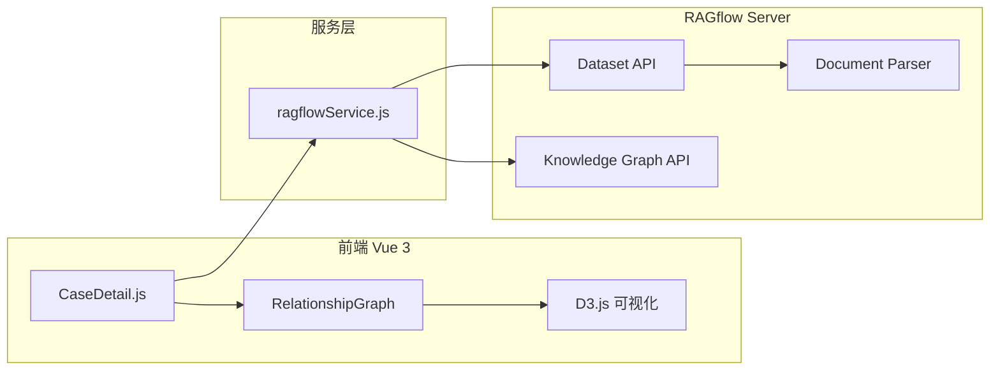

# RAGflow 集成关系洞察功能实现方案

使用 RAGflow 的知识图谱功能增强现有关系洞察模块，实现基于法律文档的智能实体关系提取与可视化。

---

## 1. 架构概述



---

## 2. RAGflow API 调用流程

| 步骤 | API 端点 | 用途 |
|------|----------|------|
| 1 | `POST /api/v1/datasets` | 创建案件专属数据集 |
| 2 | `POST /api/v1/datasets/{id}/documents` | 上传案件相关文档（证据、合同等） |
| 3 | `POST /api/v1/datasets/{id}/chunks` | 触发文档解析 |
| 4 | `POST /api/v1/datasets/{id}/run_graphrag` | 构建知识图谱 |
| 5 | `GET /api/v1/datasets/{id}/trace_graphrag` | 轮询构建状态 |
| 6 | `GET /api/v1/datasets/{id}/knowledge_graph` | 获取图谱数据 |

---

## 3. 代码变更计划

### 组件: RAGflow Service

#### [NEW] [ragflowService.js](file:///e:/工作台/odoo/legal-workspace-vue/src/services/ragflowService.js)

RAGflow API 封装服务，包含：
- 配置管理（API地址、密钥）
- Dataset CRUD 操作
- 文档上传与解析
- 知识图谱构建/获取/状态轮询
- 数据格式转换（RAGflow → D3.js）

```javascript
// 核心方法签名
export const ragflowService = {
  // 配置
  setConfig(apiUrl, apiKey),
  
  // Dataset 管理
  async createDataset(caseName, caseId),
  async uploadDocument(datasetId, file),
  async parseDocuments(datasetId, docIds),
  
  // 知识图谱
  async buildKnowledgeGraph(datasetId),
  async getGraphBuildStatus(datasetId),
  async getKnowledgeGraph(datasetId),
  
  // 数据转换
  transformToD3Format(ragflowGraph)
}
```

---

### 组件: 配置文件

#### [NEW] [ragflowConfig.js](file:///e:/工作台/odoo/legal-workspace-vue/src/config/ragflowConfig.js)

RAGflow 连接配置：

```javascript
export const RAGFLOW_CONFIG = {
  API_URL: 'http://localhost:9380',  // 默认本地部署地址
  API_KEY: '',  // 用户需配置
  ENTITY_TYPES: ['PERSON', 'ORGANIZATION', 'DOCUMENT', 'LOCATION', 'DATE', 'MONEY']
};
```

---

### 组件: 案件详情视图

#### [MODIFY] [CaseDetail.js](file:///e:/工作台/odoo/legal-workspace-vue/src/views/CaseDetail.js)

修改关系洞察标签页，集成 RAGflow：

**新增功能**：
1. 添加"同步到RAGflow"按钮，上传案件文档
2. 添加"生成知识图谱"按钮，触发 GraphRAG 构建
3. 添加构建状态显示（进度条）
4. 自动获取并渲染 RAGflow 返回的图谱数据
5. 保留手动编辑图谱能力（本地数据 + RAGflow 数据合并）

**UI 变更**：
```
+------------------------------------------+
| 关系洞察                    [刷新] [导出] |
+------------------------------------------+
| [📤 同步文档到 RAGflow]  [🔄 生成知识图谱] |
| 状态: ✅ 就绪 / ⏳ 构建中 (45%)...         |
+------------------------------------------+
|                                          |
|         [D3.js 关系图谱可视化区域]         |
|                                          |
+------------------------------------------+
| 图例        | 统计信息                   |
| ● 人物      | 实体: 12                   |
| ■ 公司      | 关系: 18                   |
| ◆ 文档      | 涉及金额: ¥500,000         |
+------------------------------------------+
```

---

## 4. RAGflow 数据格式转换

### RAGflow 返回格式
```json
{
  "graph": {
    "nodes": [
      {
        "id": "xxx",
        "entity_name": "张三",
        "entity_type": "PERSON",
        "description": "原告，借款人",
        "pagerank": 0.15
      }
    ],
    "edges": [
      {
        "source": "人物A_id",
        "target": "公司B_id",
        "description": "法定代表人",
        "weight": 10.0
      }
    ]
  }
}
```

### D3.js 目标格式
```json
{
  "nodes": [
    { "id": "xxx", "name": "张三", "type": "person", "group": 1, "role": "原告" }
  ],
  "links": [
    { "source": "xxx", "target": "yyy", "relation": "法定代表人", "amount": null }
  ]
}
```

### 转换逻辑
```javascript
function transformToD3Format(ragflowGraph) {
  const typeMap = {
    'PERSON': { type: 'person', group: 1 },
    'ORGANIZATION': { type: 'company', group: 2 },
    'DOCUMENT': { type: 'document', group: 3 },
    'MONEY': { type: 'money', group: 4 }
  };
  
  return {
    nodes: ragflowGraph.nodes.map(n => ({
      id: n.id,
      name: n.entity_name,
      type: typeMap[n.entity_type]?.type || 'other',
      group: typeMap[n.entity_type]?.group || 5,
      role: n.description
    })),
    links: ragflowGraph.edges.map(e => ({
      source: e.src_id || e.source,
      target: e.tgt_id || e.target,
      relation: e.description?.split('<SEP>')[0] || '关联',
      amount: extractAmount(e.description)
    }))
  };
}
```

---

## 5. 用户配置流程

### 首次使用配置
1. 用户在设置页面输入 RAGflow API 地址和密钥
2. 系统验证连接并保存到 localStorage
3. 刷新后自动加载配置

### Settings.js 新增配置项
```
+------------------------------------------+
| RAGflow 设置                              |
+------------------------------------------+
| API 地址: [http://localhost:9380      ]  |
| API 密钥: [••••••••••••••••••••••••••]   |
| [测试连接]  状态: ✅ 连接成功              |
| [保存配置]                                |
+------------------------------------------+
```

---

## 6. 错误处理

| 错误场景 | 处理方式 |
|----------|----------|
| RAGflow 未配置 | 显示配置引导，跳转设置页 |
| 连接失败 | Toast 提示，显示重试按钮 |
| 构建超时 | 显示"后台处理中"，支持刷新查看 |
| 图谱为空 | 保留本地数据，提示"未检测到实体关系" |
| API 限流 | 延迟重试，显示倒计时 |

---

## 7. 验证计划

### 7.1 单元测试

> [!IMPORTANT]
> 本项目目前无测试框架。需要用户决定是否添加测试。

**如果添加测试框架**：
1. 安装 Vitest: `npm install -D vitest`
2. 创建 `src/services/__tests__/ragflowService.test.js`
3. 测试数据转换函数 `transformToD3Format`

### 7.2 手动集成测试

**前置条件**：
- 本地运行 RAGflow 服务 ([安装指南](https://ragflow.io/docs/dev/launch_ragflow))
- 或使用 RAGflow Cloud

**测试步骤**：

1. **配置连接**
   - 进入"设置"页面
   - 输入 RAGflow API 地址和密钥
   - 点击"测试连接"，验证显示"连接成功"

2. **上传文档**
   - 进入案件详情 → 关系洞察
   - 点击"同步文档到 RAGflow"
   - 上传案件相关 PDF/Word 文档
   - 验证文档上传成功提示

3. **生成图谱**
   - 点击"生成知识图谱"
   - 观察进度条更新
   - 等待完成（预计 30-60 秒）
   - 验证图谱自动刷新显示

4. **验证可视化**
   - 确认图谱中显示从文档提取的实体（人物、公司等）
   - 确认实体间关系连线正确
   - 测试拖拽、缩放功能正常

---

## 8. 待确认事项

> [!CAUTION]
> **需要用户提供 RAGflow 环境信息**

1. **RAGflow 部署方式**：
   - [ ] 本地 Docker 部署
   - [ ] 私有服务器部署
   - [ ] RAGflow Cloud

2. **API 访问地址**：`_________________`

3. **是否需要添加测试框架**（Vitest）？
   - [ ] 是，添加单元测试
   - [ ] 否，仅手动测试

4. **是否需要在设置页面添加 RAGflow 配置 UI**？
   - [ ] 是，需要可视化配置
   - [ ] 否，使用环境变量或配置文件

---

## 9. 实现优先级

| 阶段 | 内容 | 预计工时 |
|------|------|----------|
| P0 | ragflowService.js 核心 API 封装 | 2h |
| P0 | 数据格式转换函数 | 1h |
| P1 | CaseDetail.js 集成 | 2h |
| P1 | 设置页面配置 UI | 1h |
| P2 | 错误处理和加载状态 | 1h |
| P2 | 本地/RAGflow 数据合并 | 1h |

**总计**: ~8 小时

---

**文档版本**: v1.0  
**更新日期**: 2025-12-09  
**编写**: AI法律助手开发团队
