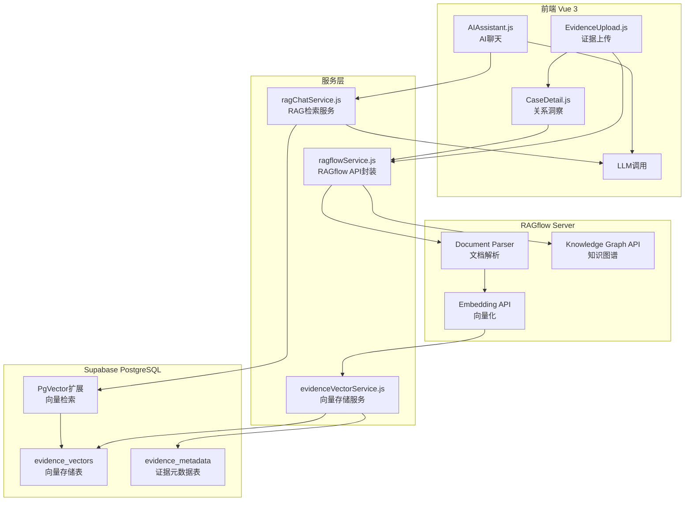
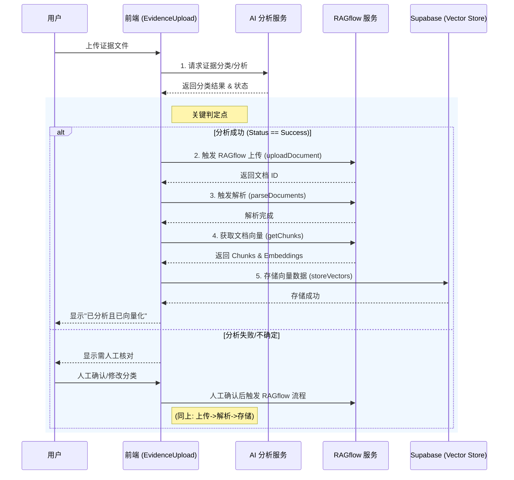

# RAGflow 集成实现方案

使用 RAGflow 实现证据向量化存储和 AI 聊天 RAG 检索，同时增强关系洞察模块的知识图谱功能。

---

## 1. 架构概述

### 1.1 整体架构



### 1.2 全流程核心架构图

该图展示了从用户上传证据、经过 AI 分类与人工确认、进入 RAGflow 解析建库、最终通过 Supabase 支持 AI 检索对话的完整生命周期。

```mermaid
flowchart TB
    subgraph UserInteraction["用户交互层"]
        START[用户上传证据]
        CONFIRM[用户人工确认类目]
        QUERY[用户发起 AI 提问]
        ANSWER[展示 AI 回答与来源]
    end

    subgraph PreProcessing["预处理与分类"]
        LLM_CLS[LLM 初步分类/分析]
        CHECK{分类置信度?}
    end

    subgraph RAGflowCore["RAGflow 核心处理"]
        RF_UPLOAD[上传至 RAGflow Dataset]
        RF_PARSE[RAGflow 解析与分块]
        RF_EMBED[生成 Vector Embeddings]
    end

    subgraph Storage["数据存储层 (Supabase)"]
        DB_VEC[(evidence_vectors 表)]
        DB_META[(evidence_metadata 表)]
    end

    subgraph RetrievalService["检索与生成服务"]
        VEC_SEARCH[向量相似度检索 (PgVector)]
        RAG_CTX[构建 RAG 上下文]
        LLM_GEN[LLM 生成最终回答]
    end

    %% 流程连接
    START --> LLM_CLS
    LLM_CLS --> CHECK
    
    CHECK -- "高置信度 (自动)" --> RF_UPLOAD
    CHECK -- "低置信度 (需确认)" --> CONFIRM
    CONFIRM --> RF_UPLOAD

    RF_UPLOAD --> RF_PARSE
    RF_PARSE --> RF_EMBED
    
    RF_EMBED -- "存储向量与元数据" --> DB_VEC
    RF_EMBED --> DB_META

    QUERY -- "1. 问题向量化" --> VEC_SEARCH
    DB_VEC -.-> VEC_SEARCH
    
    VEC_SEARCH -- "2. 获取Top-K相关片段" --> RAG_CTX
    RAG_CTX -- "3. 提示词 + 上下文" --> LLM_GEN
    LLM_GEN --> ANSWER
```

### 1.3 关键环节实现方案

#### A. 用户确认环节 (User Logic)
**场景**：当 AI 对证据分类的置信度低于阈值（如 < 0.8），或用户希望手动修正 AI 的结果时。
**实现方式**：
1. **状态暂停**：证据状态标记为 `awaiting_confirmation`。
2. **UI 交互**：在 `EvidenceUpload.js` 列表项中显示"待确认"徽标。
3. **用户操作**：用户点击下拉修正分类，点击"确认"按钮。
4. **触发流转**：
    ```javascript
    // 前端伪代码
    async confirmCategory(item, correctCategory) {
        item.category = correctCategory;
        item.status = 'confirmed';
        // 只有在用户确认后，才显式调用 RAGflow 上传
        await this.vectorizeEvidence(item); 
    }
    ```

#### B. 向量库同步 (Supabase Sync)
**场景**：RAGflow 完成解析后，需要将数据持久化到 Supabase 以便快速检索。
**实现方式**：
1. RAGflow 解析任务是异步的，前端需轮询或等待 `POST /chunks` 返回。
2. 获取 `embedding` 数组后，**必须** 携带 `evidence_id`, `case_id`, `category` 等业务元数据一同存入 `evidence_vectors` 表。
3. 利用 Supabase 的 `rpc` 调用进行原子化批量插入，防止部分写入失败。

#### C. 对话检索闭环 (Query Loop)
**场景**：用户在"AI 小助手"中提问。
**实现方式**：
1. **问题重写**（可选）：先用 LLM 将用户口语化问题转化为更适合检索的 Queries。
2. **混合检索**：
    - **语义检索**：使用 embeddings 查找相似片段。
    - **元数据过滤**：仅检索当前 `case_id` 下的向量（RLS 策略自动保证），或进一步过滤 `category`（如"只查合同"）。
3. **来源标注**：LLM 返回答案时，附带引用的 `chunk_id`，前端将其渲染为可点击的"来源 [1]"角标，点击高亮原文。
---

## 2. 核心功能流程

### 2.1 详细序列图：分类 - 向量化流程



### 2.2 证据上传与向量化流程详情

| 步骤 | 操作 | API/服务 | 说明 |
|------|------|----------|------|
| 1 | 用户上传证据文件 | `EvidenceUpload.js` | 支持 PDF、Word、图片等格式 |
| 2 | 上传到 RAGflow | `POST /api/v1/datasets/{id}/documents` | 创建或获取案件数据集 |
| 3 | RAGflow 解析文档 | `POST /api/v1/datasets/{id}/chunks` | 触发文档分块和解析 |
| 4 | 获取文档向量 | `GET /api/v1/datasets/{id}/chunks` | 获取每个 chunk 的 embedding |
| 5 | 存储到 Supabase | `evidenceVectorService.js` | 批量插入向量和元数据 |
| 6 | 更新证据状态 | `EvidenceUpload.js` | 标记向量化完成 |

### 2.2 AI 聊天 RAG 检索流程

| 步骤 | 操作 | API/服务 | 说明 |
|------|------|----------|------|
| 1 | 用户输入问题 | `AIAssistant.js` | 获取用户查询文本 |
| 2 | 问题向量化 | RAGflow Embedding API | 将问题转换为向量 |
| 3 | 向量相似度检索 | Supabase PgVector | 检索 Top-K 相似证据片段 |
| 4 | 构建 RAG 上下文 | `ragChatService.js` | 组装检索到的证据内容 |
| 5 | 调用 LLM | `llmService.js` | 将上下文和问题发送给 LLM |
| 6 | 返回回答 | `AIAssistant.js` | 展示 AI 生成的回答 |

### 2.3 关系洞察图谱流程

| 步骤 | API 端点 | 用途 |
|------|----------|------|
| 1 | `POST /api/v1/datasets` | 创建案件专属数据集 |
| 2 | `POST /api/v1/datasets/{id}/documents` | 上传案件相关文档（证据、合同等） |
| 3 | `POST /api/v1/datasets/{id}/chunks` | 触发文档解析 |
| 4 | `POST /api/v1/datasets/{id}/run_graphrag` | 构建知识图谱 |
| 5 | `GET /api/v1/datasets/{id}/trace_graphrag` | 轮询构建状态 |
| 6 | `GET /api/v1/datasets/{id}/knowledge_graph` | 获取图谱数据 |

---

## 3. 数据库表设计

### 3.1 证据向量存储表

```sql
-- 启用 PgVector 扩展
CREATE EXTENSION IF NOT EXISTS vector;

-- 证据向量表
CREATE TABLE evidence_vectors (
    id UUID PRIMARY KEY DEFAULT gen_random_uuid(),
    case_id TEXT NOT NULL,                    -- 案件ID
    evidence_id TEXT NOT NULL,               -- 证据ID（前端生成）
    file_name TEXT NOT NULL,                  -- 文件名
    file_type TEXT,                           -- 文件类型（pdf, word, image等）
    category TEXT,                            -- 证据分类（contract, payment等）
    chunk_index INTEGER NOT NULL,             -- 文档分块索引
    chunk_text TEXT NOT NULL,                 -- 文本内容
    embedding vector(1024) NOT NULL,         -- RAGflow 向量（维度根据模型调整）
    metadata JSONB,                           -- 额外元数据（页码、位置等）
    created_at TIMESTAMPTZ DEFAULT now(),
    updated_at TIMESTAMPTZ DEFAULT now(),
    
    -- 索引
    CONSTRAINT fk_case FOREIGN KEY (case_id) REFERENCES cases(id) ON DELETE CASCADE
);

-- 创建向量相似度检索索引（HNSW）
CREATE INDEX idx_evidence_vectors_embedding 
ON evidence_vectors 
USING hnsw (embedding vector_cosine_ops);

-- 创建案件和证据ID索引
CREATE INDEX idx_evidence_vectors_case ON evidence_vectors(case_id);
CREATE INDEX idx_evidence_vectors_evidence ON evidence_vectors(evidence_id);

-- RLS 策略：用户只能访问自己案件的向量
ALTER TABLE evidence_vectors ENABLE ROW LEVEL SECURITY;

CREATE POLICY "Users can view their own case vectors"
ON evidence_vectors FOR SELECT
USING (
    EXISTS (
        SELECT 1 FROM cases 
        WHERE cases.id = evidence_vectors.case_id 
        AND cases.user_id = auth.uid()
    )
);
```

### 3.2 证据元数据表（可选，用于快速查询）

```sql
CREATE TABLE evidence_metadata (
    id UUID PRIMARY KEY DEFAULT gen_random_uuid(),
    case_id TEXT NOT NULL,
    evidence_id TEXT NOT NULL,
    file_name TEXT NOT NULL,
    file_type TEXT,
    category TEXT,
    file_size BIGINT,
    upload_time TIMESTAMPTZ DEFAULT now(),
    vectorized_at TIMESTAMPTZ,                -- 向量化完成时间
    chunk_count INTEGER DEFAULT 0,           -- 分块数量
    status TEXT DEFAULT 'pending',            -- pending, processing, completed, failed
    error_message TEXT,
    
    CONSTRAINT fk_case FOREIGN KEY (case_id) REFERENCES cases(id) ON DELETE CASCADE,
    UNIQUE(case_id, evidence_id)
);

CREATE INDEX idx_evidence_metadata_case ON evidence_metadata(case_id);
```

---

## 4. 代码变更计划

### 4.1 RAGflow Service

#### [NEW] [ragflowService.js](file:///e:/工作台/odoo/legal-workspace-vue/src/services/ragflowService.js)

RAGflow API 封装服务，包含：
- 配置管理（API地址、密钥）
- Dataset CRUD 操作
- 文档上传与解析
- 向量获取（从 chunks 获取 embedding）
- 知识图谱构建/获取/状态轮询
- 数据格式转换（RAGflow → D3.js）

```javascript
// 核心方法签名
export const ragflowService = {
  // 配置
  setConfig(apiUrl, apiKey),
  
  // Dataset 管理
  async createDataset(caseName, caseId),
  async getDatasetByCaseId(caseId),
  async uploadDocument(datasetId, file),
  async parseDocuments(datasetId, docIds),
  
  // 向量获取
  async getDocumentChunks(datasetId, docId),
  async getChunkEmbedding(datasetId, chunkId),
  
  // 知识图谱
  async buildKnowledgeGraph(datasetId),
  async getGraphBuildStatus(datasetId),
  async getKnowledgeGraph(datasetId),
  
  // 数据转换
  transformToD3Format(ragflowGraph)
}
```

### 4.2 证据向量服务

#### [NEW] [evidenceVectorService.js](file:///e:/工作台/odoo/legal-workspace-vue/src/services/evidenceVectorService.js)

证据向量存储和检索服务：

```javascript
export const evidenceVectorService = {
  // 批量存储向量
  async storeVectors(caseId, evidenceId, chunks, embeddings),
  
  // 向量相似度检索
  async searchSimilarVectors(caseId, queryVector, topK = 5),
  
  // 获取证据向量
  async getEvidenceVectors(caseId, evidenceId),
  
  // 删除证据向量
  async deleteEvidenceVectors(caseId, evidenceId),
  
  // 更新证据状态
  async updateEvidenceStatus(caseId, evidenceId, status, chunkCount)
}
```

### 4.3 RAG 聊天服务

#### [NEW] [ragChatService.js](file:///e:/工作台/odoo/legal-workspace-vue/src/services/ragChatService.js)

AI 聊天 RAG 检索服务：

```javascript
export const ragChatService = {
  // 问题向量化（调用 RAGflow）
  async embedQuery(query),
  
  // RAG 检索和生成回答
  async chatWithRAG(caseId, userQuery, options = {}),
  
  // 构建 RAG 上下文
  buildRAGContext(retrievedChunks, userQuery)
}
```

---

### 4.4 配置文件

#### [NEW] [ragflowConfig.js](file:///e:/工作台/odoo/legal-workspace-vue/src/config/ragflowConfig.js)

RAGflow 连接配置：

```javascript
export const RAGFLOW_CONFIG = {
  API_URL: 'http://localhost:9380',  // 默认本地部署地址
  API_KEY: '',  // 用户需配置
  EMBEDDING_DIMENSION: 1024,  // RAGflow 向量维度
  ENTITY_TYPES: ['PERSON', 'ORGANIZATION', 'DOCUMENT', 'LOCATION', 'DATE', 'MONEY'],
  CHUNK_SIZE: 512,  // 文档分块大小
  TOP_K: 5  // 默认检索 Top-K 结果
};
```

---

### 4.5 证据上传组件修改

#### [MODIFY] [EvidenceUpload.js](file:///e:/工作台/odoo/legal-workspace-vue/src/views/EvidenceUpload.js)

**新增功能**：
1. 上传成功后自动调用 RAGflow 向量化
2. 显示向量化进度状态
3. 向量化完成后更新证据状态

**修改点**：
```javascript
// 在 simulateAnalysis 成功后，添加向量化流程
async simulateAnalysis(item) {
  // ... 原有分析逻辑 ...
  
  // 新增：调用向量化服务
  if (item.status === 'success') {
    await this.vectorizeEvidence(item);
  }
},

async vectorizeEvidence(fileItem) {
  try {
    // 1. 上传到 RAGflow
    const datasetId = await ragflowService.getDatasetByCaseId(this.caseInfo.id);
    const docId = await ragflowService.uploadDocument(datasetId, fileItem.file);
    
    // 2. 解析文档
    await ragflowService.parseDocuments(datasetId, [docId]);
    
    // 3. 获取向量
    const chunks = await ragflowService.getDocumentChunks(datasetId, docId);
    
    // 4. 存储到 Supabase
    await evidenceVectorService.storeVectors(
      this.caseInfo.id,
      fileItem.id,
      chunks,
      chunks.map(c => c.embedding)
    );
    
    // 5. 更新状态
    fileItem.vectorized = true;
  } catch (error) {
    console.error('向量化失败:', error);
    fileItem.vectorizeError = error.message;
  }
}
```

---

### 4.6 AI 助手组件修改

#### [MODIFY] [AIAssistant.js](file:///e:/工作台/odoo/legal-workspace-vue/src/views/refactor/AIAssistant.js)

**新增功能**：
1. 集成 RAG 检索，基于案件证据回答
2. 显示检索到的证据来源
3. 支持流式输出（可选）

**修改点**：
```javascript
async sendMessage(message) {
  const content = message || this.aiAssistant.input.trim();
  if (!content) return;

  // 添加用户消息
  this.aiAssistant.messages.push({
    id: Date.now(),
    role: 'user',
    content: content
  });

  this.aiAssistant.input = '';
  
  // 显示加载状态
  const loadingMsg = {
    id: Date.now() + 1,
    role: 'ai',
    content: '正在检索相关证据...',
    loading: true
  };
  this.aiAssistant.messages.push(loadingMsg);

  try {
    // 调用 RAG 聊天服务
    const response = await ragChatService.chatWithRAG(
      this.caseData.id,
      content,
      { topK: 5 }
    );

    // 移除加载消息，添加 AI 回答
    const index = this.aiAssistant.messages.findIndex(m => m.id === loadingMsg.id);
    if (index !== -1) {
      this.aiAssistant.messages.splice(index, 1);
    }

    this.aiAssistant.messages.push({
      id: Date.now() + 2,
      role: 'ai',
      content: response.answer,
      sources: response.sources  // 显示证据来源
    });
  } catch (error) {
    console.error('AI 回答失败:', error);
    // 错误处理...
  }
}
```

---

### 4.7 案件详情视图修改

#### [MODIFY] [CaseDetail.js](file:///e:/工作台/odoo/legal-workspace-vue/src/views/CaseDetail.js)

修改关系洞察标签页，集成 RAGflow：

**新增功能**：
1. 添加"同步到RAGflow"按钮，上传案件文档
2. 添加"生成知识图谱"按钮，触发 GraphRAG 构建
3. 添加构建状态显示（进度条）
4. 自动获取并渲染 RAGflow 返回的图谱数据
5. 保留手动编辑图谱能力（本地数据 + RAGflow 数据合并）

**UI 变更**：
```
+------------------------------------------+
| 关系洞察                    [刷新] [导出] |
+------------------------------------------+
| [📤 同步文档到 RAGflow]  [🔄 生成知识图谱] |
| 状态: ✅ 就绪 / ⏳ 构建中 (45%)...         |
+------------------------------------------+
|                                          |
|         [D3.js 关系图谱可视化区域]         |
|                                          |
+------------------------------------------+
| 图例        | 统计信息                   |
| ● 人物      | 实体: 12                   |
| ■ 公司      | 关系: 18                   |
| ◆ 文档      | 涉及金额: ¥500,000         |
+------------------------------------------+
```

---

## 5. 核心实现细节

### 5.1 证据向量化实现

```javascript
// evidenceVectorService.js 核心实现
async storeVectors(caseId, evidenceId, chunks, embeddings) {
  const supabase = getSupabaseClient();
  
  // 准备批量插入数据
  const vectors = chunks.map((chunk, index) => ({
    case_id: caseId,
    evidence_id: evidenceId,
    chunk_index: index,
    chunk_text: chunk.text,
    embedding: embeddings[index],  // vector 类型
    metadata: {
      page: chunk.page || null,
      position: chunk.position || null
    }
  }));
  
  // 批量插入
  const { data, error } = await supabase
    .from('evidence_vectors')
    .insert(vectors);
  
  if (error) throw error;
  
  // 更新证据元数据
  await supabase
    .from('evidence_metadata')
    .upsert({
      case_id: caseId,
      evidence_id: evidenceId,
      chunk_count: chunks.length,
      vectorized_at: new Date().toISOString(),
      status: 'completed'
    });
  
  return data;
}
```

### 5.2 向量检索实现

```javascript
// evidenceVectorService.js 向量检索
async searchSimilarVectors(caseId, queryVector, topK = 5) {
  const supabase = getSupabaseClient();
  
  // 使用 PgVector 的余弦相似度检索
  const { data, error } = await supabase.rpc('match_evidence_vectors', {
    query_embedding: queryVector,
    match_case_id: caseId,
    match_threshold: 0.7,  // 相似度阈值
    match_count: topK
  });
  
  if (error) throw error;
  return data;
}

// Supabase SQL 函数（需要在数据库中创建）
/*
CREATE OR REPLACE FUNCTION match_evidence_vectors(
  query_embedding vector(1024),
  match_case_id text,
  match_threshold float,
  match_count int
)
RETURNS TABLE (
  id uuid,
  case_id text,
  evidence_id text,
  chunk_text text,
  similarity float
)
LANGUAGE plpgsql
AS $$
BEGIN
  RETURN QUERY
  SELECT
    ev.id,
    ev.case_id,
    ev.evidence_id,
    ev.chunk_text,
    1 - (ev.embedding <=> query_embedding) as similarity
  FROM evidence_vectors ev
  WHERE ev.case_id = match_case_id
    AND 1 - (ev.embedding <=> query_embedding) > match_threshold
  ORDER BY ev.embedding <=> query_embedding
  LIMIT match_count;
END;
$$;
*/
```

### 5.3 RAG 聊天实现

```javascript
// ragChatService.js 核心实现
async chatWithRAG(caseId, userQuery, options = {}) {
  const { topK = 5 } = options;
  
  // 1. 问题向量化（调用 RAGflow）
  const queryVector = await this.embedQuery(userQuery);
  
  // 2. 向量检索
  const retrievedChunks = await evidenceVectorService.searchSimilarVectors(
    caseId,
    queryVector,
    topK
  );
  
  // 3. 构建 RAG 上下文
  const context = this.buildRAGContext(retrievedChunks, userQuery);
  
  // 4. 调用 LLM（使用 llmService）
  const prompt = await llmService.getPromptConfig('rag_chat');
  const response = await fetch(prompt.model_url, {
    method: 'POST',
    headers: {
      'Content-Type': 'application/json',
      'Authorization': `Bearer ${prompt.api_key}`
    },
    body: JSON.stringify({
      model: prompt.model_name,
      messages: [
        {
          role: 'system',
          content: prompt.system_prompt + '\n\n相关证据内容：\n' + context
        },
        {
          role: 'user',
          content: userQuery
        }
      ]
    })
  });
  
  const result = await response.json();
  
  return {
    answer: result.choices[0].message.content,
    sources: retrievedChunks.map(c => ({
      evidence_id: c.evidence_id,
      chunk_text: c.chunk_text.substring(0, 200) + '...',
      similarity: c.similarity
    }))
  };
}

buildRAGContext(chunks, query) {
  return chunks
    .map((chunk, index) => `[证据片段 ${index + 1}]\n${chunk.chunk_text}`)
    .join('\n\n');
}
```

---

## 6. RAGflow 数据格式转换

### RAGflow 返回格式
```json
{
  "graph": {
    "nodes": [
      {
        "id": "xxx",
        "entity_name": "张三",
        "entity_type": "PERSON",
        "description": "原告，借款人",
        "pagerank": 0.15
      }
    ],
    "edges": [
      {
        "source": "人物A_id",
        "target": "公司B_id",
        "description": "法定代表人",
        "weight": 10.0
      }
    ]
  }
}
```

### D3.js 目标格式
```json
{
  "nodes": [
    { "id": "xxx", "name": "张三", "type": "person", "group": 1, "role": "原告" }
  ],
  "links": [
    { "source": "xxx", "target": "yyy", "relation": "法定代表人", "amount": null }
  ]
}
```

### 转换逻辑
```javascript
function transformToD3Format(ragflowGraph) {
  const typeMap = {
    'PERSON': { type: 'person', group: 1 },
    'ORGANIZATION': { type: 'company', group: 2 },
    'DOCUMENT': { type: 'document', group: 3 },
    'MONEY': { type: 'money', group: 4 }
  };
  
  return {
    nodes: ragflowGraph.nodes.map(n => ({
      id: n.id,
      name: n.entity_name,
      type: typeMap[n.entity_type]?.type || 'other',
      group: typeMap[n.entity_type]?.group || 5,
      role: n.description
    })),
    links: ragflowGraph.edges.map(e => ({
      source: e.src_id || e.source,
      target: e.tgt_id || e.target,
      relation: e.description?.split('<SEP>')[0] || '关联',
      amount: extractAmount(e.description)
    }))
  };
}
```

---

## 7. 用户配置流程

### 首次使用配置
1. 用户在设置页面输入 RAGflow API 地址和密钥
2. 系统验证连接并保存到 localStorage
3. 刷新后自动加载配置

### Settings.js 新增配置项
```
+------------------------------------------+
| RAGflow 设置                              |
+------------------------------------------+
| API 地址: [http://localhost:9380      ]  |
| API 密钥: [••••••••••••••••••••••••••]   |
| [测试连接]  状态: ✅ 连接成功              |
| [保存配置]                                |
+------------------------------------------+
```

---

## 8. 错误处理

| 错误场景 | 处理方式 |
|----------|----------|
| RAGflow 未配置 | 显示配置引导，跳转设置页 |
| 连接失败 | Toast 提示，显示重试按钮 |
| 构建超时 | 显示"后台处理中"，支持刷新查看 |
| 图谱为空 | 保留本地数据，提示"未检测到实体关系" |
| API 限流 | 延迟重试，显示倒计时 |

---

## 9. 验证计划

### 7.1 单元测试

> [!IMPORTANT]
> 本项目目前无测试框架。需要用户决定是否添加测试。

**如果添加测试框架**：
1. 安装 Vitest: `npm install -D vitest`
2. 创建 `src/services/__tests__/ragflowService.test.js`
3. 测试数据转换函数 `transformToD3Format`

### 7.2 手动集成测试

**前置条件**：
- 本地运行 RAGflow 服务 ([安装指南](https://ragflow.io/docs/dev/launch_ragflow))
- 或使用 RAGflow Cloud

**测试步骤**：

1. **配置连接**
   - 进入"设置"页面
   - 输入 RAGflow API 地址和密钥
   - 点击"测试连接"，验证显示"连接成功"

2. **上传文档**
   - 进入案件详情 → 关系洞察
   - 点击"同步文档到 RAGflow"
   - 上传案件相关 PDF/Word 文档
   - 验证文档上传成功提示

3. **生成图谱**
   - 点击"生成知识图谱"
   - 观察进度条更新
   - 等待完成（预计 30-60 秒）
   - 验证图谱自动刷新显示

4. **验证可视化**
   - 确认图谱中显示从文档提取的实体（人物、公司等）
   - 确认实体间关系连线正确
   - 测试拖拽、缩放功能正常

---

## 10. 待确认事项

> [!CAUTION]
> **需要用户提供 RAGflow 环境信息**

1. **RAGflow 部署方式**：
   - [ ] 本地 Docker 部署
   - [ ] 私有服务器部署
   - [ ] RAGflow Cloud

2. **API 访问地址**：`_________________`

3. **是否需要添加测试框架**（Vitest）？
   - [ ] 是，添加单元测试
   - [ ] 否，仅手动测试

4. **是否需要在设置页面添加 RAGflow 配置 UI**？
   - [ ] 是，需要可视化配置
   - [ ] 否，使用环境变量或配置文件

---

## 11. 实现优先级

| 阶段 | 内容 | 预计工时 | 依赖 |
|------|------|----------|------|
| **P0 - 核心基础设施** |
| P0 | Supabase 数据库表创建（evidence_vectors, evidence_metadata） | 1h | - |
| P0 | PgVector 扩展启用和索引创建 | 0.5h | - |
| P0 | ragflowService.js 核心 API 封装 | 2h | RAGflow 环境 |
| P0 | evidenceVectorService.js 向量存储服务 | 2h | 数据库表 |
| P0 | ragChatService.js RAG 检索服务 | 2h | 向量服务 |
| **P1 - 功能集成** |
| P1 | EvidenceUpload.js 集成向量化流程 | 2h | ragflowService |
| P1 | AIAssistant.js 集成 RAG 检索 | 2h | ragChatService |
| P1 | CaseDetail.js 关系图谱集成 | 2h | ragflowService |
| P1 | 设置页面 RAGflow 配置 UI | 1h | - |
| **P2 - 优化与完善** |
| P2 | 错误处理和加载状态 | 1h | - |
| P2 | 向量检索性能优化（批量检索） | 1h | - |
| P2 | 流式输出支持（可选） | 2h | - |
| P2 | 证据来源显示和跳转 | 1h | - |

**总计**: ~18.5 小时

### 11.1 分阶段实施建议

**第一阶段（MVP）**：P0 全部 + P1 前3项
- 实现证据上传后自动向量化
- 实现 AI 聊天 RAG 检索
- 预计工时：~13 小时

**第二阶段（完善）**：P1 剩余 + P2 前2项
- 关系图谱集成
- 配置界面和错误处理
- 预计工时：~5.5 小时

---

## 12. 技术注意事项

### 12.1 RAGflow 向量维度

- RAGflow 默认使用 BGE 模型，向量维度为 **1024**
- 如果使用其他模型，需要调整 `evidence_vectors.embedding` 的维度
- Supabase PgVector 支持动态维度，但建议固定维度以优化性能

### 12.2 向量检索性能

- **HNSW 索引**：适合大规模向量检索（>10万条）
- **IVFFlat 索引**：适合中小规模（<10万条），构建更快
- 建议根据数据量选择合适的索引类型

```sql
-- HNSW 索引（推荐用于生产环境）
CREATE INDEX idx_evidence_vectors_embedding 
ON evidence_vectors 
USING hnsw (embedding vector_cosine_ops)
WITH (m = 16, ef_construction = 64);

-- IVFFlat 索引（适合开发/测试）
CREATE INDEX idx_evidence_vectors_embedding_ivf
ON evidence_vectors 
USING ivfflat (embedding vector_cosine_ops)
WITH (lists = 100);
```

### 12.3 文档分块策略

- **分块大小**：建议 512-1024 tokens
- **重叠窗口**：建议 50-100 tokens，避免上下文断裂
- **分块方式**：按段落 > 按句子 > 固定长度

### 12.4 向量检索优化

- **Top-K 选择**：建议 3-10，根据回答质量调整
- **相似度阈值**：建议 0.7-0.8，过滤低质量结果
- **混合检索**：可结合关键词检索（BM25）提升召回率

---

## 附录 A：RAGflow 建库 API 详解与部署

### A.1 RAGflow 本地部署指南

RAGflow **完全支持**本地私有化部署，推荐使用 Docker。

1. **环境准备**：
   - Docker >= 24.0.0
   - Docker Compose >= v2.26.1
   - 推荐配置：4核 CPU, 16GB RAM

2. **部署命令**：
   ```bash
   # 1. 克隆仓库
   git clone https://github.com/infiniflow/ragflow.git
   cd ragflow/docker

   # 2. 启动服务 (自动拉取镜像并启动)
   docker compose -f docker-compose.yml up -d

   # 3. 访问系统
   # 浏览器访问 http://localhost
   # 默认账号/密码请查看 logs 或文档 (通常需注册首个用户)
   ```

3. **获取 API Key**：
   - 登录 RAGflow 控制台
   - 点击右上角头像 -> API Key -> Create API Key
   - **记录此 Key**，后续代码交互需要提供。

### A.2 建库 API 实现流程 (基于 SDK/API)

要通过 API 实现"建库+上传+解析"，你需要按顺序调用以下接口。

**你需要提供的信息**：
1. **RAGflow Base URL** (如 `http://localhost:9380`)
2. **API Key**
3. **文件对象** (Binary/Blob)

#### 1. 创建数据集 (Create Dataset)
* **API**: `POST /api/v1/datasets`
* **Python SDK**: `rag_object.create_dataset(name="...")`
* **关键参数**:
  - `name`: 数据集名称
  - `permission`: "me" (私有) 或 "team"
  - `chunk_method`: **"naive"** (通用), "manual", "qa", "table", "laws" (法律专用), "knowledge-graph" 等
  - `parser_config`: 根据 `chunk_method` 不同而变化。
    - *示例 (naive)*: `{"chunk_token_num": 512, "delimiter": "\\n", "layout_recognize": true}`

#### 2. 上传文件 (Upload Document)
* **API**: `POST /api/v1/datasets/{dataset_id}/documents`
* **Python SDK**: `dataset.upload_documents([{"display_name": "...", "blob": ...}])`
* **Content-Type**: `multipart/form-data`
* **Body**: `file` (文件二进制流)

#### 3. 触发解析 (Parse Document)
* **API**: `POST /api/v1/datasets/{dataset_id}/chunks` (对应 SDK `async_parse_documents`)
* **Python SDK**: `dataset.async_parse_documents(document_ids=[...])`
* **Body**: `{"document_ids": ["doc_id_1", ...]}`
* **状态检查**：解析是异步的。需轮询文档状态接口，直到 `run_status` 变为 `'1'` (DONE)。

#### 4. 获取解析结果 (List Chunks)
* **API**: `GET /api/v1/datasets/{dataset_id}/documents/{document_id}/chunks`
* **Python SDK**: `document.list_chunks(page=1, page_size=1000)`
* **返回数据**:
  - `id`: Chunk ID
  - `content_with_weight`: 文本内容
  - `important_keywords`: 关键词列表
  - `img_id`: 如有切片图片

### A.3 常见问题 (FAQ)

**Q: 是否必须使用 RAGflow 的向量数据库？**
A: RAGflow 内置了 Elasticsearch/Infinity 用于存储。但在本方案中，我们仅利用 RAGflow 进行**解析 (Parsing)** 和 **Embedding 生成**，最终向量存储在 **Supabase** (PostgreSQL) 中，以便与案件业务数据强关联。

**Q: RAGflow 解析需要多久？**
A: 取决于文件大小和硬件。本地 CPU 部署下，一份 50 页 PDF 通常需要 10-30 秒。

---

## 13. 方案评估与风险分析

### 13.1 可行性评估 (Feasibility)
- **总体结论**：**方案高度可执行**。
- **架构合理性**：采用 "RAGflow (解析/计算) + Supabase (存储/检索)" 的分离模式是合理的。它结合了 RAGflow 强大的文档解析能力（如表格、OCR）和 Supabase 与业务数据的无缝结合。
- **关键路径验证**：
  - API 均已公开且文档齐全。
  - 数据格式转换（Graph -> D3）逻辑清晰。
  - 前端轮询机制处理异步解析是标准做法。

### 13.2 执行难度评估 (Difficulty Analysis)

| 维度 | 难度等级 | 主要挑战 | 应对建议 |
|------|----------|----------|----------|
| **基础设施** | ⭐⭐⭐⭐ (高) | 用户需本地部署 RAGflow (Docker)，对硬件有要求 (16G+ RAM) | 提供详细的 Docker Compose `yml` 和一键启动脚本；推荐使用高性能主机。 |
| **后端/API** | ⭐⭐⭐ (中) | 异步任务状态管理；Supabase 与 RAGflow 的数据一致性 | 即使 RAGflow 成功，若 Supabase 写入失败需有重试机制；增加"同步状态"字段。 |
| **前端开发** | ⭐⭐ (低) | 轮询逻辑的实现；加载状态的优雅展示 | 封装统一的 `PollingService`；使用 WebSocket (若需更实时)。 |
| **数据安全** | ⭐⭐⭐ (中) | RAGflow API Key 暴露风险 (在纯前端模式下) | **建议**：通过 Supabase Edge Function 代理请求，避免 Key 对外暴露。 |

### 13.3 风险与对策

1.  **数据不同步风险 (Data Desync)**
    *   *风险*：RAGflow 解析成功，但 Supabase 写入中断（网络问题/浏览器崩溃）。
    *   *对策*：在 `EvidenceUpload.js` 实现"断点续传"逻辑。应用启动时检查 `processing` 状态的证据，自动尝试重新从 RAGflow 获取 chunks 并入库。

2.  **解析延迟 (Latency)**
    *   *风险*：大文件解析可能耗时 1-2 分钟，用户可能关闭页面。
    *   *对策*：
        *   短期：提示用户"请勿关闭页面"。
        *   长期：将轮询逻辑移至 Supabase Edge Function (Cron Jobs) 或队列处理。

3.  **Docker 资源占用**
    *   *风险*：本地运行 RAGflow 可能占用大量内存，拖慢开发机。
    *   *对策*：开发阶段建议使用 RAGflow Cloud 或远端服务器，仅在生产/演示时使用本地部署。

---

**文档版本**: v2.3  
**更新日期**: 2025-12-25  
**主要变更**: 新增方案评估与风险分析章节
