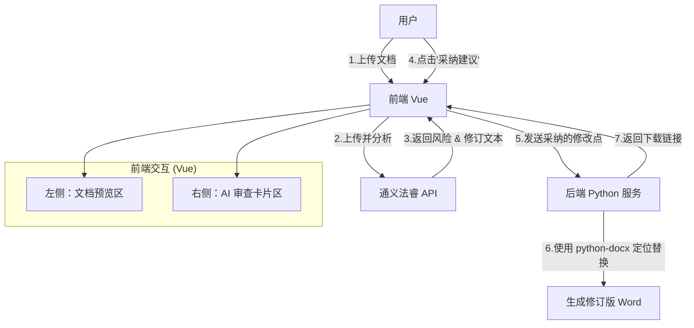

# 合同审查功能预览与编辑实现方案

## 1. 接口功能澄清

**通义法睿的“合同审查”接口（`RunContractResultGeneration`等）本身不具备文档预览或在线编辑功能。**
这些接口是纯数据接口：

- **输入**：文档 ID、审查立场。
- **输出**：文本形式的风险提示、原文片段 (`originalContent`) 和 修订建议 (`resultContent`)。

**结论**：文档的**预览、UI 展示、编辑交互**以及**最终修订文件的生成**，都需要我们自己开发实现。

---

## 2. 推荐实现方案：左右分栏智能审查模式

考虑到法律合同对**格式严谨性**要求极高，直接将 Word 转为 HTML 编辑（如使用 Quill/Tiptap）容易导致段落、页眉页脚、编号等复杂格式丢失。因此，推荐使用 **“原文只读预览 + 侧边栏 AI 建议 + 后端无损修订”** 的方案。

### 架构设计图



### 3. 具体技术选型

#### A. 前端：文档预览

使用 `vue-office` 组件库进行 Word 文档的轻量级预览。它能在浏览器中较好地还原 Word 样式用于阅读。

- **库名**: `@vue-office/docx`
- **安装**: `npm install @vue-office/docx`
- **使用**:
  ```html
  <template>
    <vue-office-docx :src="docxUrl" @rendered="renderedHandler" />
  </template>
  ```

#### B. 前端：交互设计

1.  **左侧 (60%)**: 展示合同原文（只读）。
2.  **右侧 (40%)**: 渲染 AI 返回的 `subRisks` 列表。
    - 每个卡片显示：**风险点**、**风险等级**、**原文** (红色高亮)、**AI 建议** (绿色高亮)。
    - **操作按钮**: `[采纳]` `[忽略]` `[手动修改]`。
3.  **高亮定位 (进阶)**: 当用户点击右侧卡片时，尝试在左侧预览中搜索 `originalContent` 并滚动到对应位置（`vue-office` 支持简单的 DOM 操作，可能需要自定义实现搜索高亮）。

#### C. 后端：修订版生成 (Core)

当用户点击“导出修订版”时，后端基于原始 Word 文件和用户“采纳”的修改建议列表，生成新的 Word 文件。

- **工具**: `python-docx` (Python)
- **逻辑**:

  ```python
  from docx import Document

  def generate_revised_contract(original_path, revisions):
      doc = Document(original_path)
      for rev in revisions:
          # 遍历所有段落查找原文
          for para in doc.paragraphs:
              if rev['original_content'] in para.text:
                  # 简单替换：将原文替换为建议内容
                  # 进阶替换：使用 Word 的 'Track Changes' 格式（需更底层 XML 操作）
                  para.text = para.text.replace(rev['original_content'], rev['result_content'])

      save_path = "revised_" + original_path
      doc.save(save_path)
      return save_path
  ```

  _注意：更高级的“修订模式(Track Changes)”标记需要操作 Word XML，`python-docx` 原生支持有限，通常简单替换或标红即可满足 MVP 需求。_

---

## 4. 实施步骤

1.  **引入预览库**: 在 Vue 项目中安装 `@vue-office/docx`。
2.  **开发审查页面**:
    - 布局：左右分栏。
    - 状态管理：存储 API 返回的 `rules` 和 `results`。
    - 交互：点击“采纳”将该条建议加入 `acceptedRevisions` 数组。
3.  **开发后端接口**:
    - `POST /api/contract/export-revised`: 接收 `fileId` 和 `acceptedRevisions`，返回新的下载 URL。

## 5. 替代方案 (如果必须在线编辑)

如果用户坚持要像 Google Docs 一样直接编辑：

- **方案一 (重型)**: 集成 **OnlyOffice** 或 **Collabora**。需要部署独立的 Docker 服务，成本高，但兼容性完美。
- **方案二 (轻型)**: 使用 **Tiptap / CKEditor**。将 Docx 转 HTML 编辑。
  - _缺点_: 导出回 Docx 时，复杂的合同格式（目录、多级编号、页边距）极大概率乱掉，**这对法律合同是致命的**。
  - _建议_: 除非只是简单文本合同，否则不推荐此方案。

**综上所述，强烈建议采用“方案 2：左右分栏智能审查模式”，既能利用 AI 的能力，又能保证合同文件的格式安全。**

---

## 5. 如果必须“方案一”（在线 Word 编辑器），除了 OnlyOffice/Collabora 还有哪些？

如果您需要**完整的 Word 在线编辑体验**（类似 Google Docs/Office 365），但觉得 OnlyOffice/Collabora 部署太重或界面不符，可以考虑 **商业 SaaS 集成** 或 **Canvas 渲染开源** 方案。

### 替代方案 A：阿里云 WebOffice (推荐)

因为您已经接入了通义法睿（阿里云体系），直接使用阿里云的 **智能媒体管理 (IMM) - WebOffice** 是最顺滑的选择。

- **优点**：
  - **深度集成**：与阿里云 OSS 和通义法睿生态兼容性最好。
  - **无需部署**：SaaS 服务，不需要自己运维 Docker 容器。
  - **功能强大**：支持多人协作、水印、修订模式（Track Changes），完美契合法律合同审查需求。
  - **对接文档**：[智能媒体管理 IMM - WebOffice 官方文档](https://help.aliyun.com/zh/oss/user-guide/online-object-editing?spm=a2c4g.11186623.0.0.5c9c1888fiio9j)
- **成本**：按 API 调用次数或流量计费（后付费）。

### 替代方案 B：WPS WebOffice 开放平台

在国内法律行业，WS Office 的普及率极高，其格式兼容性可能是最好的。

- **优点**：
  - **极致兼容**：对“红头文件”、公文格式支持最好。
  - **体验熟悉**：操作界面与 PC 版 WPS 一致，用户上手 0 成本。
- **缺点**：商业版需要购买授权/API 额度。

### 替代方案 C：Canvas-Editor (开源轻量级)

如果不想购买 SaaS，也不想部署 OnlyOffice 那么重的服务，可以尝试基于 Canvas 渲染的新一代前端编辑器（如 `hufe921/canvas-editor`）。

- **原理**：不使用 HTML DOM，而是用 Canvas 逐字渲染，从而实现类似 Word 的分页和精确排版。
- **优点**：纯前端组件，轻量，分页效果比 Tiptap/Quill 好得多。
- **缺点**：作为开源项目，功能成熟度不如商业软件（如复杂的表格嵌套、OLE 对象可能不支持），需要较强的二次开发能力。

**选型建议**：

- 如果预算充足且追求稳定 -> **阿里云 WebOffice** (技术栈统一) 或 **WPS** (体验好)。
- 如果必须私有化且 0 预算 -> **OnlyOffice** (最成熟)。
- 如果愿意折腾前端技术 -> **Canvas-Editor**。

---

## 6. 附录：合同抽取功能的集成方案

针对通义法睿的“合同抽取”API（`/pop/contract/extraction`），由于其仅返回 JSON 数据（提取的字段及原文），UI 实现逻辑与合同审查高度相似。

### 6.1 方案推荐：只读预览 + 自动填充

**核心逻辑**：利用 API 返回的 `originalText` 实现“点击表单定位原文”。

1.  **左侧预览**：复用 **`@vue-office/docx`** 组件（与合同审查方案保持技术栈一致）。
2.  **右侧表单**：根据 API 返回的 `extractResult` 自动填充 `<input>`。
3.  **交互亮点**：
    - **高亮原文**：前端通过搜索 `originalText` 文本内容，在左侧 DOM 中动态添加背景色（`<span style="background: yellow">`）。
    - **双向定位**：
      - 点击右侧输入框 -> 左侧滚动到原文位置。
      - 点击左侧原文 -> 右侧对应的输入框闪烁聚焦。

### 6.2 在线编辑需求

如果在抽取数据的同时需要**修改合同原文**（例如发现合同金额写错了，不仅要改表单，还要改 Word 文件），则同样适用上述 **第 5 节** 提到的解决方案：

- **推荐**：集成 **阿里云 WebOffice** 或 **WPS**，在 tab 页中通过 iframe 嵌入编辑器。
