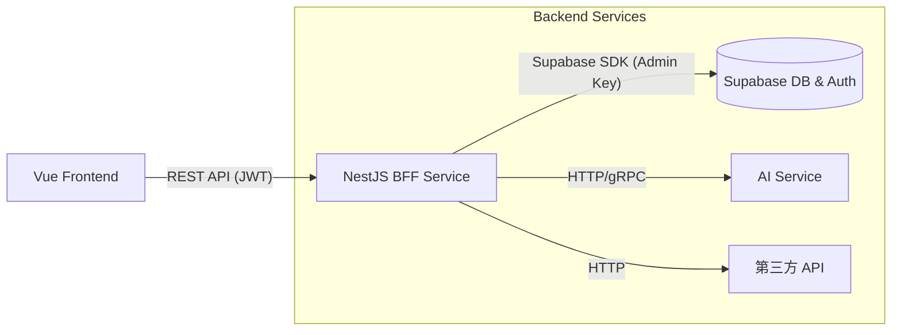

# Supabase + BFF 集成实施方案

> **状态**: 建议草案
> **目标**: 在现有 Supabase BaaS 架构基础上，平滑引入 BFF (Backend for Frontend) 层，以增强业务逻辑控制、安全性及第三方服务聚合能力。

## 1. 核心理念

在引入 BFF 后，Supabase 的角色将从 **"直接面向前端的 BaaS"** 转变为 **"高性能数据存储与认证服务"**。

- **前端 (Frontend)**: 不再直接连接 Supabase DB，而是调用 BFF 提供的 RESTful API。
- **BFF 层**: 承担"业务管家"角色，负责参数校验、权限控制、数据聚合（Supabase + AI + 第三方）、格式转换。
- **Supabase**: 继续处理底层数据存储 (PostgreSQL)、认证 (Auth) 和 文件存储 (Storage)。

## 2. 架构拓扑



## 3. 具体实施步骤

### 3.1 步骤一：BFF 服务初始化

1.  **创建 NestJS 项目**:
    ```bash
    nest new legal-bff
    ```
2.  **配置依赖**:
    - `@supabase/supabase-js`: 用于连接 Supabase。
    - `@nestjs/config`: 管理环境变量。
    - `passport-jwt`: 解析 Supabase 颁发的 JWT。

### 3.2 步骤二：认证对接 (关键)

前端继续使用 Supabase Auth 进行登录，获取 `access_token`。**BFF 负责验证这个 Token。**

**前端工作**:

- 登录逻辑不变。
- API 请求头携带 Token: `Authorization: Bearer <access_token>` (已在 M6 完成)。

**BFF 工作**:

- 实现 JWT Strategy，使用 Supabase 的 `JWT Secret` 验证签名。
- 解析出 `user_id` 和 `role`，注入到 Request 上下文中。

### 3.3 步骤三：数据访问模式迁移

**模式 A: 代理模式 (透传 RLS)**

- BFF 接收前端 Token，创建 Scoped Supabase Client。
- **优点**: 复用 Supabase 现有的 RLS (Row Level Security) 规则，无需在 BFF 重写权限逻辑。
- **适用**: 简单的 CRUD 操作。

```typescript
// NestJS Service 示例
async findAll(userToken: string) {
  // 使用用户的 Token 创建 Client，受 RLS 限制
  const client = createClient(url, key, {
    global: { headers: { Authorization: `Bearer ${userToken}` } }
  });
  return client.from('cases').select('*');
}
```

**模式 B: 管理员模式 (Bypass RLS)**

- BFF 使用 `SUPABASE_SERVICE_ROLE_KEY` (超级管理员权限)。
- **优点**: 拥有完全的数据访问权限，适合跨用户聚合数据、执行复杂业务逻辑、处理敏感数据。
- **注意**: 必须在 BFF 代码中严格实现权限检查！

```typescript
// NestJS Service 示例
async generateReport(userId: string) {
  // 使用 Service Role Key，无视 RLS
  const adminClient = createClient(url, serviceRoleKey);
  // 手动检查权限...
  // 执行复杂查询...
  return data;
}
```

### 3.4 步骤四：AI 服务集成

这是引入 BFF 的最大动力之一。

1.  前端发起请求: `POST /api/ai/analyze`
2.  BFF 接收请求，校验用户额度。
3.  BFF 调用 Python AI Service (或直接调大模型 API)。
4.  BFF 将结果（支持 SSE 流式）返回前端。
    - _前端已在 M6 完成 SSE 支持，无缝对接。_

## 4. 推荐推进路线 (MVP)

1.  **搭建空壳 BFF**: 初始化 NestJS，跑通 "Hello World" 和 JWT 验证。
2.  **迁移一个高频接口**: 选择 `GET /cases` (案件列表)。
    - 在 BFF 实现该接口，代理 Supabase 查询。
    - 前端切换 `USE_BFF=true`，验证列表加载。
3.  **迁移 AI 接口**: 将 AI 调用逻辑从前端移入 BFF (隐藏 API Key)。
4.  **逐步铺开**: 随着业务迭代，逐步迁移剩余接口。

## 5. 常见问题 (FAQ)

**Q: 是否需要完全重写所有 API？**
A: **不需要。** 可以在很长一段时间内保持"混合模式"。

- 复杂/敏感业务（Case Create, AI, Payment）走 BFF。
- 简单/高频读操作（字典表、只读数据）可继续直连 Supabase (如有必要)。
- _但在本项目中，为了架构统一，建议最终全量迁移。_

**Q: RLS 规则还需要写吗？**
A: **建议保留。** 即使有 BFF，DB 层的 RLS 是最后一道防线。尽量采用 "模式 A (透传 Token)"，让 Supabase 帮你做权限控制，BFF 只做业务组装。

**Q: 如何本地开发联调？**
A: 本地启动 NestJS 服务 (端口 3000)，前端配置 `.env` 中的 `VITE_API_BASE_URL=http://localhost:3000/api`。
