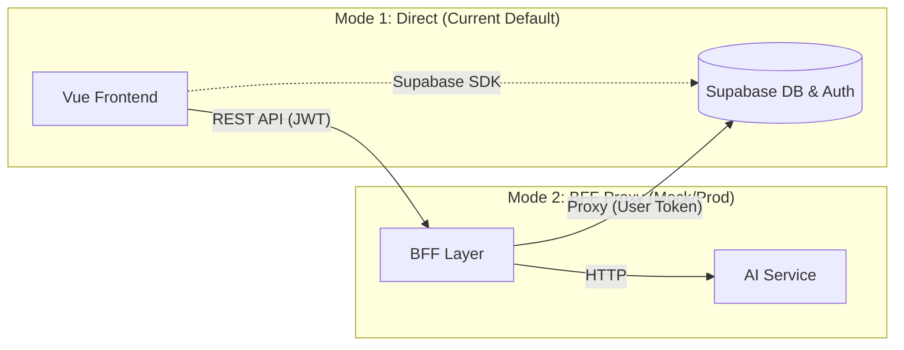

# Supabase + BFF 集成实施方案

> **状态**: ✅ 已实施 (Phase 1)
> **最后更新**: 2026-01-08
> **适用版本**: v3.14+

## 1. 核心理念

本项目采用 **"BaaF (Backend as a Frontend)"** 架构的演进路线。在 Phase 1 阶段，我们通过引入统一的 `ApiClient` 和 BFF 代理层，实现了从"直接连接 BaaS"到"通过服务层中转"的架构平滑过渡。

- **前端层 (Frontend)**: 统一通过 `src/services/api-client.js` 发起请求，支持通过配置切换直连模式或 BFF 模式。
- **BFF 层 (Mock/Proxy)**: 目前由 Express 搭建的轻量级代理服务 (`tools/mock-server`) 承担，负责验证 Supabase Token 并透传 RLS 规则。
- **数据层 (Supabase)**: 继续负责核心数据存储、认证和行级安全 (RLS)。

## 2. 架构拓扑



## 3. 已实施内容 (Phase 1)

### 3.1 前端架构改造 (完成)

前端已彻底剥离对 `supabase-js` 的直接依赖（除 Auth 外），所有业务请求通过统一的 `ApiClient` 发送。

**核心组件**: `src/services/api-client.js`

- **统一拦截器**: 支持 Request/Response 拦截，统一处理 Token 注入和错误格式化。
- **双模式支持**:
  - `VITE_USE_BFF=false`: Service 层直接调用 Supabase SDK（保持兼容）。
  - `VITE_USE_BFF=true`: Service 层通过 HttpClient 调用 BFF 接口。
- **高级特性**:
  - **自动 Token 注入**: 自动从 Supabase Session 获取 JWT 并添加到 `Authorization` 头。
  - **请求取消**: 集成 `AbortController`，支持页面切换自动取消请求。
  - **SSE 流式支持**: 原生支持 AI 对话的 Server-Sent Events 流式响应。
  - **智能缓存**: 内置内存缓存 (`cachedGet`)，优化高频读操作。

### 3.2 BFF 服务端 (Mock Ready)

为了验证 BFF 模式，我们实现了一个基于 Express 的完整 Mock Server。

**位置**: `tools/mock-server/`

- **技术栈**: Express + Supabase Client (Node.js) + Cors
- **鉴权机制**: 实现了 `supabaseMiddleware`，解析前端传递的 Bearer Token，创建 Scoped Supabase Client。
- **代理模式**: 采用 "透传模式 (Proxy Mode)"，BFF 直接使用用户的 JWT 操作数据库，复用 Supabase RLS 规则，无需重复编写权限代码。
- **已实现接口**:
  - `GET/POST/PUT/DELETE /api/v1/cases` (案件管理)
  - `GET/PUT /api/v1/cases/:id/financials` (财务信息，含去重逻辑)
  - `GET/POST/PUT/DELETE /api/v1/stakeholders` (当事人管理)

### 3.3 环境变量配置

支持通过 `.env` 灵活切换模式：

```ini
# --- 模式 1: 直连 Supabase (生产默认) ---
VITE_USE_BFF=false
VITE_SUPABASE_URL=https://xxx.supabase.co
VITE_SUPABASE_ANON_KEY=xxx

# --- 模式 2: 本地 BFF 开发 ---
VITE_USE_BFF=true
VITE_API_BASE_URL=http://localhost:3000/api/v1
```

## 4. 验证与测试

### 4.1 启动 Mock BFF

```bash
# 启动 Mock服务器 (运行在 :3000)
npm run mock:server
```

### 4.2 验证 BFF 模式

1. 修改 `.env` 设置 `VITE_USE_BFF=true`。
2. 启动前端 `npm run dev`。
3. 访问案件列表，观察 Network 请求：
   - 请求 URL 应变为 `http://localhost:3000/api/v1/cases`。
   - 请求头应包含 `Authorization: Bearer <JWT>`。
4. 验证数据读写是否正常（Mock Server 会打印详细日志）。

## 5. 常见问题 (FAQ)

**Q: 为什么保留双模式？**
A: 为了降低架构风险。生产环境目前仍稳定运行在直连模式下，BFF 模式可用于开发复杂功能（如 AI 聚合、跨系统集成），成熟一个模块迁移一个。

**Q: Mock Server 能用于生产吗？**
A: **不能。** Mock Server 仅用于本地联调和验证接口契约。生产环境应将其逻辑迁移到 NestJS 或 Serverless Functions 中，以获得更好的性能、日志监控和类型安全。

**Q: 现有 RLS 规则是否有效？**
A: **有效且关键。** BFF 的 Proxy 模式依赖数据库层的 RLS 进行最后一道权限拦截。切勿在 BFF 中使用 `service_role key` 除非你明确知道自己在绕过权限系统。
