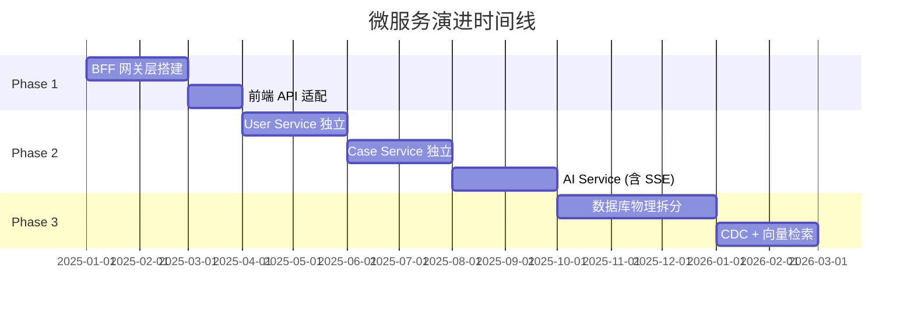
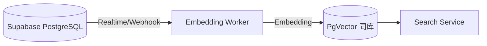
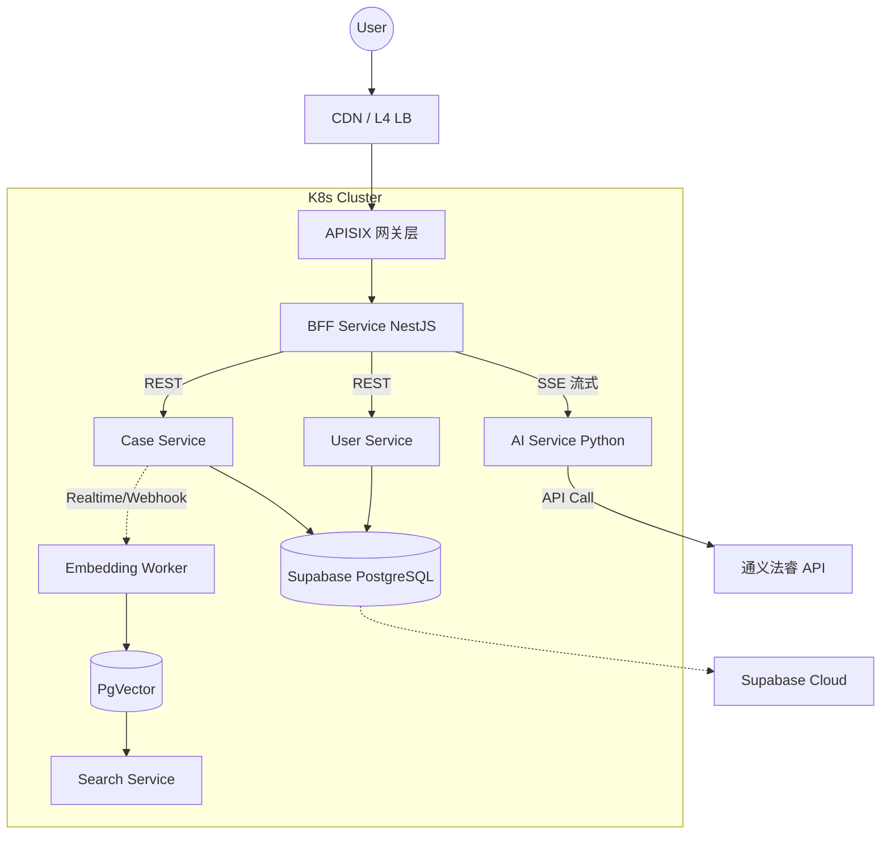

# AI 法律助手 - 微服务治理演进文档

> **版本**: v1.1 (Expert Review Refined)  
> **最后更新**: 2025-12-24  
> **关联文档**: [架构设计文档](./架构设计文档.md)

---

## 目录

1. [现状分析](#1-现状分析)
2. [演进路线图](#2-演进路线图)
3. [Phase 1: BFF 网关层引入](#3-phase-1-bff-网关层引入)
4. [Phase 2: 业务逻辑下沉 (逻辑隔离)](#4-phase-2-业务逻辑下沉-逻辑隔离)
5. [Phase 3: 领域微服务拆分](#5-phase-3-领域微服务拆分-保留-supabase)
6. [微服务治理体系 (云原生轻量化)](#6-微服务治理体系-云原生轻量化)
7. [法律 AI 特性支持](#7-法律-ai-特性支持)
8. [资源与基础设施](#8-资源与基础设施)
9. [风险与应对](#9-风险与应对)

---

## 1. 现状分析

### 1.1 当前架构模式

**Monolithic SPA + BaaS (Backend-as-a-Service)**

```
┌─────────────────────────────────────────────────────────────┐
│                      Vue 3 前端 (SPA)                         │
│   ┌──────┐ ┌──────┐ ┌──────┐ ┌──────┐ ┌──────┐             │
│   │案件  │ │检索  │ │合同  │ │文书  │ │用户  │             │
│   │管理  │ │功能  │ │审查  │ │生成  │ │中心  │             │
│   └──┬───┘ └──┬───┘ └──┬───┘ └──┬───┘ └──┬───┘             │
│      └────────┴────────┴────┬───┴────────┘                 │
│                             ↓                               │
│                    supabase-js SDK                         │
└─────────────────────────────────────────────────────────────┘
                              ↓
    ┌─────────────────────────┴─────────────────────────┐
    │                   Supabase Cloud                    │
    │  ┌─────────┐  ┌─────────┐  ┌─────────┐            │
    │  │  Auth   │  │ Database│  │ Storage │            │
    │  └─────────┘  └─────────┘  └─────────┘            │
    └─────────────────────────────────────────────────────┘
```

### 1.2 现状痛点

| 问题领域            | 具体表现                                                      | 微服务价值         |
| :------------------ | :------------------------------------------------------------ | :----------------- |
| **耦合度高**        | 前端直连数据库，业务逻辑散落在 Vue 组件和 RLS 中              | 服务解耦，职责单一 |
| **扩展性差**        | 法睿 API 调用量大时无法独立扩容                               | 按服务独立伸缩     |
| **技术栈受限**      | 只能使用 JavaScript/Node，无法选择 Python (AI) 或 Go (高性能) | 技术栈异构         |
| **AI 流式支持缺失** | 无法实时推送 AI 生成过程                                      | SSE/WebSocket 支持 |

### 1.3 团队技术基因

> **核心约束**：团队以 **Node.js (NestJS)** 和 **Python (FastAPI)** 为主，无 Java 开发经验。
> 所有技术选型必须遵循 **"去 Java 化"** 原则，避免引入 JVM 生态组件。

---

## 2. 演进路线图

> **核心原则**: 渐进式重构，不停服务。每个阶段可独立上线，验证价值。



| 阶段        | 里程碑              | 预计周期 | 核心产出                                        |
| :---------- | :------------------ | :------- | :---------------------------------------------- |
| **Phase 1** | BFF 网关            | 3 个月   | NestJS API Gateway，前端改调 BFF                |
| **Phase 2** | 逻辑下沉 + 逻辑隔离 | 6 个月   | User/Case/AI 服务独立，**数据库账号隔离**       |
| **Phase 3** | 领域拆分 + AI 增强  | 5 个月   | **Schema 隔离** (保留 Supabase)，CDC 同步向量库 |

---

## 3. Phase 1: BFF 网关层引入

**目标**: 在前端与 Supabase 之间插入一层自研 API 网关，解耦前后端依赖。

### 3.1 技术选型 (去 Java 化)

| 组件         | 推荐方案                | ~~弃用方案~~             | 理由                                    |
| :----------- | :---------------------- | :----------------------- | :-------------------------------------- |
| **BFF 框架** | **NestJS (TypeScript)** | -                        | 类型安全，模块化架构                    |
| **API 网关** | **APISIX** 或 **Kong**  | ~~Spring Cloud Gateway~~ | 基于 Nginx/Lua，无 JVM 负担，多语言插件 |
| **部署方式** | Docker + K3s            | Serverless (Vercel)      | 可控性强，便于后续微服务化              |

### 3.2 请求链路设计

> **关键约束**: BFF 专注业务聚合，网关专注流量治理。职责分离。

```
Client
  → [L4 LB / CDN]
  → [APISIX (网关层): SSL 卸载、限流、黑白名单、Canary]
  → [BFF (NestJS): 数据聚合、格式裁剪、鉴权)]
  → [微服务层]
```

### 3.3 实施步骤

```
步骤 1: 创建 BFF 项目
├── nest new legal-bff
├── 配置 Supabase Admin Client (服务端 SDK)
└── 配置通义法睿 API 调用

步骤 2: 迁移数据请求
├── 将前端 `supabase.from('cases').select()`
│   改为 `fetch('/api/cases')`
├── BFF 层调用 Supabase，返回格式化数据
└── 逐模块迁移 (User → Case → Search)

步骤 3: 统一鉴权
├── 前端仅携带 JWT Token
├── BFF 验证 Token 并注入 user_id
└── 禁用前端直接访问 Supabase
```

---

## 4. Phase 2: 业务逻辑下沉 (逻辑隔离)

**目标**: 将散落在前端的业务逻辑迁移到后端服务，并通过 **数据库账号隔离** 预防"分布式单体"陷阱。

### 4.1 服务划分

| 服务名称           | 职责边界                             | 技术栈           | 优先级 |
| :----------------- | :----------------------------------- | :--------------- | :----- |
| **User Service**   | 认证、用户资料、RBAC                 | NestJS           | P0     |
| **Case Service**   | 案件 CRUD、当事人、财务              | NestJS           | P0     |
| **Search Service** | 案例/法规检索、缓存                  | NestJS           | P1     |
| **AI Service**     | 风险分析、文书生成 (**含 SSE 流式**) | Python (FastAPI) | P0     |
| **Doc Service**    | 合同审查、文档预览/OCR               | Python / Node    | P2     |

### 4.2 逻辑隔离：共享库下的强制边界

> ⚠️ **核心约束**: Phase 2 物理上共享一个 PostgreSQL，但必须通过数据库账号实现逻辑隔离。

```sql
-- 为每个服务创建独立的数据库角色
CREATE ROLE user_service_role LOGIN PASSWORD 'xxx';
CREATE ROLE case_service_role LOGIN PASSWORD 'xxx';
CREATE ROLE ai_service_role LOGIN PASSWORD 'xxx';

-- User Service 只能操作 profiles 表
GRANT SELECT, INSERT, UPDATE, DELETE ON profiles TO user_service_role;

-- Case Service 只能操作 cases, parties, contacts 表
GRANT SELECT, INSERT, UPDATE, DELETE ON cases, parties, contacts TO case_service_role;

-- 禁止跨表 JOIN！所有跨域数据获取必须走内部 HTTP/gRPC 调用
```

**代码层约束**:

- 所有 Service 的 `ORM` 配置必须使用对应的 `*_service_role` 账号连接。
- **Code Review 卡点**: 禁止任何 `JOIN` 查询涉及非本服务管辖的表。

### 4.3 通信模式

```
┌──────────────┐      REST/gRPC      ┌──────────────┐
│  BFF Gateway │ ◄─────────────────► │ User Service │
└──────┬───────┘                     └──────────────┘
       │
       │ REST/gRPC
       ▼
┌──────────────┐      Event (MQ)     ┌──────────────┐
│ Case Service │ ─────────────────► │  AI Service  │
└──────────────┘                     └──────────────┘
      案件创建事件                   异步执行风险分析
```

### 4.4 BFF 层 N+1 问题解决

> 当前端请求 20 条案件列表时，BFF 不能循环调用 20 次 User Service。

**解决方案**: 集成 **DataLoaders** 或 **Redis 批量缓存**。

```typescript
// BFF 层使用 DataLoader 批处理
import DataLoader from 'dataloader';

const userLoader = new DataLoader(async (userIds: string[]) => {
  // 单次批量查询，而非 N 次单独查询
  const users = await userService.batchGetByIds(userIds);
  return userIds.map(id => users.find(u => u.id === id));
});

// 调用时
const user = await userLoader.load(case.userId);
```

---

## 5. Phase 3: 领域微服务拆分 (保留 Supabase)

**目标**: 在保留 Supabase PostgreSQL 的前提下，通过 **Schema 隔离** 实现逻辑独立。

> **核心决策**: 继续使用 Supabase 托管数据库，免运维、内置 Auth/Storage，符合当前业务规模。

### 5.1 数据拆分策略 (Schema 隔离)

| 原表                           | 归属服务       | Supabase 内部署                          |
| :----------------------------- | :------------- | :--------------------------------------- |
| `profiles`                     | User Service   | `user_schema.profiles`                   |
| `cases`, `parties`, `contacts` | Case Service   | `case_schema.cases`                      |
| `evidence`                     | Doc Service    | `doc_schema.evidence` + Supabase Storage |
| 向量索引                       | Search Service | **PgVector 扩展** (Supabase 原生支持)    |

### 5.2 Schema 隔离实施

```sql
-- 在 Supabase SQL Editor 中执行
CREATE SCHEMA user_schema;
CREATE SCHEMA case_schema;
CREATE SCHEMA doc_schema;

-- 迁移表到对应 Schema
ALTER TABLE profiles SET SCHEMA user_schema;
ALTER TABLE cases SET SCHEMA case_schema;

-- 更新服务的数据库连接配置
-- User Service: search_path = 'user_schema'
-- Case Service: search_path = 'case_schema'
```

### 5.3 向量检索 (PgVector)

> Supabase 原生支持 **PgVector 扩展**，无需额外部署 Milvus。

```sql
-- 启用 PgVector
CREATE EXTENSION IF NOT EXISTS vector;

-- 创建向量索引表
CREATE TABLE case_schema.case_embeddings (
  id UUID PRIMARY KEY,
  case_id UUID REFERENCES case_schema.cases(id),
  embedding vector(1536),  -- OpenAI/通义 embedding 维度
  content TEXT
);

-- 创建 HNSW 索引加速检索
CREATE INDEX ON case_schema.case_embeddings
  USING hnsw (embedding vector_cosine_ops);
```

### 5.4 CDC 数据同步 (可选进阶)

> 当 Case Service 更新案件文书时，可通过 **Supabase Realtime** 或 **Database Webhooks** 触发向量更新。



**技术选型 (保留 Supabase 方案)**:

- **事件触发**: Supabase Realtime 或 Database Webhooks (无需 Debezium)
- **消息队列**: 可选 Redis Streams (轻量) 或 Supabase Edge Functions 直接处理
- **向量库**: **PgVector** (Supabase 内置，无需额外部署)

---

## 6. 微服务治理体系 (云原生轻量化)

> **核心原则**: 充分利用 K8s 原生能力，避免引入 Java 生态重型组件。

### 6.1 基础设施组件 (去 Java 化)

| 组件类型     | ~~原方案~~               | **推荐方案**                           | 理由                               |
| :----------- | :----------------------- | :------------------------------------- | :--------------------------------- |
| **服务注册** | ~~Nacos~~                | **K8s Service (CoreDNS)**              | K8s 原生服务发现，零运维           |
| **配置中心** | ~~Nacos~~                | **K8s ConfigMap/Secret** 或 **Consul** | Consul 为 Go 编写，无 JVM 负担     |
| **API 网关** | ~~Spring Cloud Gateway~~ | **APISIX / Kong**                      | Nginx/Lua 内核，高性能             |
| **链路追踪** | SkyWalking               | **Jaeger**                             | Go 编写，云原生标准                |
| **消息队列** | RocketMQ / Kafka         | **Kafka** 或 **Redis Streams**         | Kafka 为 Scala/Java 但可用托管服务 |
| **监控告警** | Prometheus + Grafana     | **Prometheus + Grafana**               | 社区标准                           |

### 6.2 服务发现 (K8s 原生)

```yaml
# K8s Service 定义 - 无需额外注册中心
apiVersion: v1
kind: Service
metadata:
  name: user-service
spec:
  selector:
    app: user-service
  ports:
    - port: 3000
---
# 其他服务通过 DNS 直接调用
# http://user-service.default.svc.cluster.local:3000
```

### 6.3 配置管理 (K8s ConfigMap)

```yaml
apiVersion: v1
kind: ConfigMap
metadata:
  name: case-service-config
data:
  DATABASE_HOST: 'case-db.default.svc.cluster.local'
  FARUI_API_KEY: 'xxx'
---
# 动态更新: 修改 ConfigMap 后，Pod 自动重载（需配合 Reloader）
```

---

## 7. 法律 AI 特性支持

### 7.1 流式响应 (SSE/WebSocket)

> 法律 AI 生成（如合同起草、风险分析）通常需要 10-30 秒。必须支持流式输出，实时推送到前端。

**架构设计**:

```
Client (Vue)
    ↓ SSE Request
APISIX (网关)
    ↓ Proxy (保持长连接)
BFF (NestJS)
    ↓ SSE 转发
AI Service (FastAPI)
    ↓ 调用大模型 API (Streaming)
通义法睿 / 本地模型
```

**FastAPI 实现**:

```python
from fastapi import FastAPI
from fastapi.responses import StreamingResponse

@app.post("/api/ai/generate-contract")
async def generate_contract(request: ContractRequest):
    async def stream_response():
        async for chunk in call_llm_streaming(request):
            yield f"data: {chunk}\n\n"
    return StreamingResponse(stream_response(), media_type="text/event-stream")
```

**NestJS BFF 转发**:

```typescript
@Post('ai/generate-contract')
async generateContract(@Req() req, @Res() res) {
  res.setHeader('Content-Type', 'text/event-stream');
  const stream = await this.aiService.streamGenerate(req.body);
  stream.pipe(res);
}
```

### 7.2 AI Service 部署策略

| 模式           | 适用场景                     | 资源需求                             |
| :------------- | :--------------------------- | :----------------------------------- |
| **Proxy Mode** | 仅调用通义法睿 API           | CPU 密集 (Prompt 工程)，**无需 GPU** |
| **Local Mode** | 私有化小模型 (OCR, 隐私清洗) | 需要 GPU (T4/4090)                   |

**建议**: 初期使用 **Proxy Mode** 节省成本，仅 CPU 节点或 Serverless GPU 按需调用。

---

## 8. 资源与基础设施

### 8.1 MVP 起步配置 (Phase 1-2)

| 组件         | 规格        | 数量 | 说明                                         |
| :----------- | :---------- | :--- | :------------------------------------------- |
| K3s Node     | 4C 8G       | 3    | 混合部署 BFF + 服务                          |
| **Supabase** | Pro Plan    | 1    | **保留现有**，含 PostgreSQL + Auth + Storage |
| Redis        | 云 Redis 2G | 1    | 会话与缓存                                   |
| APISIX       | (共享 K8s)  | -    | 部署在 K3s 内                                |

### 8.2 生产高可用配置 (Phase 3)

| 组件              | 规格                 | 数量 | 说明                           |
| :---------------- | :------------------- | :--- | :----------------------------- |
| K8s Master        | 4C 8G                | 3    | 控制平面 HA                    |
| K8s Worker (业务) | 8C 16G               | 5+   | 业务服务节点                   |
| K8s Worker (AI)   | 8C 16G (可选 GPU)    | 2    | AI 推理 (仅 Local Mode 需 GPU) |
| **Supabase**      | Team/Enterprise Plan | 1    | **保留**，升级套餐支持更高并发 |
| Redis Cluster     | 4C 8G                | 6    | 3主3从                         |
| (可选) Kafka      | 托管服务             | -    | 仅当事件量极大时引入           |

---

## 9. 风险与应对

| 风险                     | 影响             | 应对措施                                                     |
| :----------------------- | :--------------- | :----------------------------------------------------------- |
| **团队技术储备不足**     | 项目延期         | Phase 1 不要求微服务经验，NestJS 学习曲线平缓                |
| **Phase 2 "分布式单体"** | Phase 3 拆分失败 | **强制数据库账号隔离**，Code Review 卡点                     |
| **数据迁移失败**         | 业务中断         | 双写同步 + 灰度切流                                          |
| **分布式事务复杂**       | 数据不一致       | 优先最终一致性；关键场景 (支付) 用 **TCC** 或 **本地消息表** |
| **AI 流式输出卡顿**      | 用户体验差       | 网关配置长连接超时；BFF 使用流式转发                         |

---

## 附录: 优化后的架构图



---

**文档维护者**: Alpha&Leader Legal Tech  
**最后更新**: 2025-12-24  
**版本**: v1.1 (Expert Review Refined)
