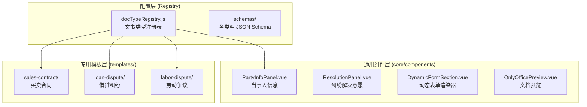

# 要素式文书功能实施方案 (通用架构版)

## 1. 背景与目标

为提升法律文书起草效率，本项目新增**「要素式文书」**功能。

### 功能入口

- **位置**：侧边栏「智能分析」分组，与法律检索、合同审查、文书生成并列
- **路由**：`/structured-doc`
- **名称**：要素式文书

### 设计理念

采用**配置驱动 + 组件复用**的通用架构，初期以**买卖合同纠纷民事起诉状**为切入点，后续可快速扩展至**民间借贷纠纷**、**劳动争议**、**租赁合同纠纷**等多种文书类型。

## 2. 总体架构

### 2.1 核心设计理念

- **注册表模式**：所有文书类型通过 `docTypeRegistry` 注册，新增类型仅需配置
- **组件分层复用**：通用组件（当事人信息、纠纷解决意愿）跨类型复用，专用组件按类型隔离
- **Schema 驱动**：每种文书类型有独立的 JSON Schema，定义字段结构与校验规则
- **动态路由**：通过 URL 参数决定渲染哪种文书类型

### 2.2 架构图



## 3. 目录结构

```bash
src/features/document/
├── core/                           # 核心框架层
│   ├── registry/
│   │   └── docTypeRegistry.js      # 文书类型注册表 (核心)
│   ├── schemas/                    # 各类型 JSON Schema
│   │   ├── salesContract.schema.js
│   │   ├── loanDispute.schema.js
│   │   └── laborDispute.schema.js
│   └── components/                 # 通用基础组件
│       ├── PartyInfoPanel.vue      # 当事人信息 (可复用)
│       ├── ResolutionPanel.vue     # 纠纷解决意愿 (可复用)
│       ├── DynamicFormSection.vue  # 动态表单渲染器
│       └── OnlyOfficePreview.vue   # 预览组件
│
├── templates/                      # 文书类型专用模板
│   ├── sales-contract/             # 买卖合同纠纷
│   │   ├── index.js                # 模板配置导出
│   │   ├── ClaimRequestPanel.vue   # 诉讼请求 (专用)
│   │   └── FactReasonPanel.vue     # 事实与理由 (专用)
│   ├── loan-dispute/               # 民间借贷纠纷
│   │   ├── index.js
│   │   ├── LoanDetailsPanel.vue    # 借贷事实
│   │   └── RepaymentPanel.vue      # 还款情况
│   └── labor-dispute/              # 劳动争议 (待扩展)
│       └── ...
│
├── services/
│   ├── docService.js               # 通用 API 服务
│   └── schemaValidator.js          # Schema 校验器
│
├── views/
│   ├── StructuredDocList.vue       # 文书列表入口
│   └── StructuredDocForm.vue       # 通用填报页
│
└── router.js                       # 动态路由定义
```

## 4. 核心组件设计

### 4.1 文书类型注册表 (docTypeRegistry.js)

```javascript
// src/features/document/core/registry/docTypeRegistry.js

export const docTypeRegistry = {
  'sales-contract': {
    id: 'sales-contract',
    name: '买卖合同纠纷民事起诉状',
    category: 'civil',
    icon: 'mdi-file-document',
    description: '适用于商品买卖、货款追讨等纠纷',
    schema: () => import('../schemas/salesContract.schema.js'),
    panels: [
      { id: 'party', component: 'PartyInfoPanel', label: '当事人信息', shared: true },
      { id: 'claim', component: 'sales-contract/ClaimRequestPanel', label: '诉讼请求' },
      { id: 'fact', component: 'sales-contract/FactReasonPanel', label: '事实与理由' },
      { id: 'resolution', component: 'ResolutionPanel', label: '纠纷解决意愿', shared: true }
    ]
  },

  'loan-dispute': {
    id: 'loan-dispute',
    name: '民间借贷纠纷民事起诉状',
    category: 'civil',
    icon: 'mdi-cash',
    description: '适用于个人借贷、欠款纠纷',
    schema: () => import('../schemas/loanDispute.schema.js'),
    panels: [
      { id: 'party', component: 'PartyInfoPanel', label: '当事人信息', shared: true },
      { id: 'loan', component: 'loan-dispute/LoanDetailsPanel', label: '借贷事实' },
      { id: 'repayment', component: 'loan-dispute/RepaymentPanel', label: '还款情况' },
      { id: 'claim', component: 'loan-dispute/LoanClaimPanel', label: '诉讼请求' },
      { id: 'resolution', component: 'ResolutionPanel', label: '纠纷解决意愿', shared: true }
    ]
  },

  'labor-dispute': {
    id: 'labor-dispute',
    name: '劳动争议民事起诉状',
    category: 'civil',
    icon: 'mdi-briefcase',
    description: '适用于劳动合同、工资支付等争议',
    schema: () => import('../schemas/laborDispute.schema.js'),
    panels: [
      // 待定义
    ]
  }
}

// 辅助函数
export function getDocType(id) {
  return docTypeRegistry[id]
}
export function getAllDocTypes() {
  return Object.values(docTypeRegistry)
}
export function getDocTypesByCategory(category) {
  return Object.values(docTypeRegistry).filter(d => d.category === category)
}
```

### 4.2 侧边栏入口配置

```vue
<!-- src/components/layout/Sidebar.vue -->
<!-- 在「智能分析」分组下添加入口 -->
<a
  :class="['nav-item', { active: isActive('/structured-doc') }]"
  aria-label="要素式文书"
  @click.prevent="navigate('/structured-doc')"
>
  <i class="fas fa-clipboard-list" />
  <span v-show="!isCollapsed">要素式文书</span>
</a>
```

### 4.3 路由模块配置

```javascript
/**
 * 要素式文书模块路由
 * 文件：src/router/modules/structured-doc.js
 * 注意：路径为相对路径，嵌套在 AppLayout 下
 */
export default [
  {
    path: 'structured-doc',
    name: 'StructuredDocList',
    component: () => import('@/features/document/views/StructuredDocList.vue'),
    meta: { title: '要素式文书' }
  },
  {
    // 动态路由：通过 :docType 参数决定渲染哪种文书
    path: 'structured-doc/:docType',
    name: 'StructuredDocForm',
    component: () => import('@/features/document/views/StructuredDocForm.vue'),
    meta: { title: '填写文书' },
    props: true
  }
]
```

### 4.3 通用表单页 (StructuredDocForm.vue)

```vue
<template>
  <div class="structured-doc-form">
    <h1>{{ docConfig?.name }}</h1>

    <!-- 动态渲染面板组件 -->
    <component
      v-for="panel in docConfig?.panels"
      :key="panel.id"
      :is="loadPanel(panel)"
      v-model="formData[panel.id]"
      :schema="panelSchema[panel.id]"
    />

    <div class="actions">
      <button @click="handlePreview">预览</button>
      <button @click="handleExport">导出 Word</button>
    </div>
  </div>
</template>

<script setup>
import { ref, computed, onMounted } from 'vue'
import { useRoute } from 'vue-router'
import { getDocType } from '../core/registry/docTypeRegistry'

const route = useRoute()
const docType = computed(() => route.params.docType)
const docConfig = ref(null)
const formData = ref({})

onMounted(async () => {
  docConfig.value = getDocType(docType.value)
  // 加载 schema 并初始化表单数据
})

function loadPanel(panel) {
  if (panel.shared) {
    return () => import(`../core/components/${panel.component}.vue`)
  }
  return () => import(`../templates/${panel.component}.vue`)
}
</script>
```

## 5. 数据字典设计

### 5.1 通用字段 (所有文书类型复用)

#### 当事人信息 (PartyInfoPanel)

| 字段名      | 类型   | 说明              | 校验规则                           |
| :---------- | :----- | :---------------- | :--------------------------------- |
| `type`      | String | 主体类型          | 必填, 枚举: `'natural'`, `'legal'` |
| `name`      | String | 姓名/名称         | 必填                               |
| `gender`    | String | 性别              | type='natural' 时可选              |
| `birthDate` | Date   | 出生日期          | type='natural' 时可选              |
| `idCard`    | String | 身份证号/统信代码 | 格式校验                           |
| `address`   | String | 住所地/注册地     | 必填                               |
| `contact`   | String | 联系电话          | 必填，手机号格式                   |
| `legalRep`  | String | 法定代表人        | type='legal' 时必填                |

### 5.2 买卖合同专用字段

_(保持原有 3.3.2、3.3.3 节内容，此处省略)_

## 6. API 接口定义

### 6.1 通用请求结构

```json
{
  "docType": "sales-contract",
  "version": "1.0",
  "data": {
    "party": {
      /* 当事人数据 */
    },
    "claim": {
      /* 诉讼请求数据 */
    },
    "fact": {
      /* 事实理由数据 */
    },
    "resolution": {
      /* 纠纷解决意愿 */
    }
  }
}
```

### 6.2 Endpoint

| 操作      | Method | Path                                  |
| :-------- | :----- | :------------------------------------ |
| 预览文档  | POST   | `/api/v1/document/structured/preview` |
| 导出 Word | POST   | `/api/v1/document/structured/export`  |
| 保存草稿  | POST   | `/api/v1/document/structured/draft`   |

## 7. 扩展新文书类型指南

> **添加新文书类型仅需 3 步：**

### Step 1: 创建 Schema

```javascript
// src/features/document/core/schemas/rentalDispute.schema.js
export default {
  id: 'rental-dispute',
  fields: {
    // 定义字段结构
  },
  validation: {
    // 定义校验规则
  }
}
```

### Step 2: 创建专用组件 (如需要)

```bash
# 在 templates/ 下创建新目录
src/features/document/templates/rental-dispute/
├── index.js
├── RentalFactPanel.vue
└── RentalClaimPanel.vue
```

### Step 3: 注册到 Registry

```javascript
// docTypeRegistry.js 添加配置
'rental-dispute': {
  id: 'rental-dispute',
  name: '房屋租赁纠纷民事起诉状',
  category: 'civil',
  icon: 'mdi-home',
  description: '适用于房屋租赁相关纠纷',
  schema: () => import('../schemas/rentalDispute.schema.js'),
  panels: [
    { id: 'party', component: 'PartyInfoPanel', label: '当事人信息', shared: true },
    { id: 'rental', component: 'rental-dispute/RentalFactPanel', label: '租赁事实' },
    { id: 'claim', component: 'rental-dispute/RentalClaimPanel', label: '诉讼请求' },
    { id: 'resolution', component: 'ResolutionPanel', label: '纠纷解决意愿', shared: true }
  ]
}
```

## 8. 开发里程碑

### Phase 1: 框架搭建

- [ ] 创建 `core/registry/docTypeRegistry.js`
- [ ] 创建通用组件 `PartyInfoPanel.vue`、`ResolutionPanel.vue`
- [ ] 配置动态路由

### Phase 2: 买卖合同模板

- [ ] 创建 `templates/sales-contract/` 目录及组件
- [ ] 创建 `salesContract.schema.js`
- [ ] 实现表单数据聚合与校验

### Phase 3: 预览与导出

- [ ] 开发 `OnlyOfficePreview.vue` 组件
- [ ] 实现 `docService` Mock 逻辑
- [ ] 联调预览流程

### Phase 4: 扩展验证

- [ ] 添加第二种文书类型（民间借贷纠纷）验证架构扩展性
- [ ] UI 样式精修
- [ ] 全面测试
