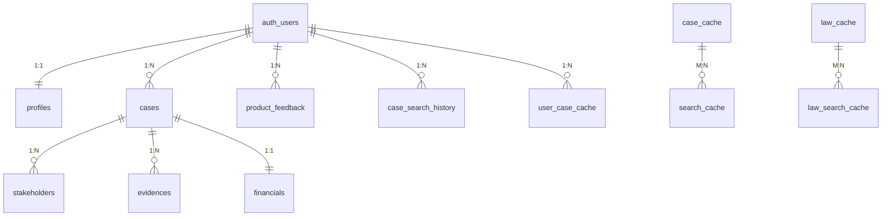

# Supabase 数据库表结构文档

> **版本**: v1.1  
> **最后更新**: 2025-12-22  
> **数据库**: Supabase (PostgreSQL)

---

## 目录

1. [数据库概览](#数据库概览)
2. [核心业务表](#核心业务表)
3. [搜索与缓存表](#搜索与缓存表)
4. [系统配置表](#系统配置表)
5. [表关系图](#表关系图)
6. [RLS 安全策略](#rls-安全策略)
7. [触发器与函数](#触发器与函数)
8. [Storage Buckets](#storage-buckets)

---

## 数据库概览

| 表名                    | 描述         | RLS | 主要用途                           |
| ----------------------- | ------------ | :-: | ---------------------------------- |
| `cases`                 | 案件主表     | ✅  | 核心业务对象，存储案件基础信息     |
| `stakeholders`          | 案件当事人   | ✅  | 存储原告、被告、第三人等信息       |
| `evidences`             | 案件证据     | ✅  | 存储案件相关的证据文件及元数据     |
| `financials`            | 财务信息     | ✅  | 存储案件标的、律师费、诉讼费等数据 |
| `profiles`              | 用户资料     | ✅  | 存储用户扩展信息（姓名、职位等）   |
| `product_feedback`      | 产品反馈     | ✅  | 收集用户反馈和问题建议             |
| `brand_settings`        | 品牌设置     | ✅  | 动态管理系统 Logo、文案、主题色    |
| `search_filter_options` | 检索筛选项   | ✅  | 存储案例和法规检索的下拉过滤项     |
| `case_search_history`   | 搜索历史     | ✅  | 记录用户的搜索词和参数             |
| `case_cache`            | 案例缓存     | ✅  | 缓存从外部 API 获取的案例详细内容  |
| `law_cache`             | 法律缓存     | ✅  | 缓存法律法规的正文内容             |
| `search_cache`          | 搜索结果映射 | ✅  | 映射查询关键词与案例 ID 列表       |
| `law_search_cache`      | 法规搜索缓存 | ✅  | 映射查询关键词与法规 ID 列表       |
| `user_case_cache`       | 用户搜索分析 | ✅  | 存储 AI 提取的搜索关键词和参数     |
| `llm_prompts`           | LLM 提示词   | ✅  | 管理 AI 交互所需的模型配置和提示词 |
| `search_suggestions`    | 搜索建议     | ✅  | 提供首页搜索框的快捷建议词         |

---

## 核心业务表

### 1. cases（案件主表）

| 字段名          | 类型        | 约束        | 默认值            | 描述                           |
| --------------- | ----------- | ----------- | ----------------- | ------------------------------ |
| `id`            | UUID        | PRIMARY KEY | gen_random_uuid() | 案件唯一标识                   |
| `user_id`       | UUID        | FK          | auth.uid()        | 所属用户                       |
| `case_title`    | TEXT        | NOT NULL    | -                 | 案件名称                       |
| `case_number`   | TEXT        | -           | -                 | 案号 (如 (2026)沪0101民初123)  |
| `case_type`     | TEXT        | -           | -                 | 案由 (如 合同纠纷)             |
| `status`        | TEXT        | -           | 'draft'           | 状态：draft, active, closed    |
| `stage`         | TEXT        | -           | '咨询'            | 阶段：咨询, 立案, 一审, 二审...|
| `court`         | TEXT        | -           | -                 | 管辖法院                       |
| `judge`         | TEXT        | -           | -                 | 承办法官                       |
| `assignee`      | TEXT        | -           | -                 | 负责人 (律师)                  |
| `client_name`   | TEXT        | -           | -                 | 委托人/客户名称                |
| `filing_date`   | DATE        | -           | -                 | 立案日期                       |
| `deadline`      | DATE        | -           | -                 | 诉讼时效/上诉截止日            |
| `description`   | TEXT        | -           | -                 | 案情摘要                       |
| `dispute_focus` | JSONB       | -           | '[]'              | 争议焦点 (数组)                |
| `objective`     | TEXT        | -           | -                 | 客户诉求                       |
| `created_at`    | TIMESTAMPTZ | -           | now()             | 创建时间                       |
| `updated_at`    | TIMESTAMPTZ | -           | now()             | 更新时间                       |

### 2. stakeholders（当事人表）

| 字段名                   | 类型        | 约束         | 默认值            | 描述                                              |
| ------------------------ | ----------- | ------------ | ----------------- | ------------------------------------------------- |
| `id`                     | UUID        | PRIMARY KEY  | gen_random_uuid() | 唯一标识                                          |
| `case_id`                | UUID        | FK (CASCADE) | -                 | 关联案件                                          |
| `type`                   | TEXT        | NOT NULL     | -                 | **plaintiff** / **defendant** / **third_party** |
| `entity_type`            | TEXT        | -            | 'person'          | 主体类型: **person** (自然人) / **company** (法人)|
| `name`                   | TEXT        | NOT NULL     | -                 | 姓名/名称                                         |
| `id_number`              | TEXT        | -            | -                 | 证件号码 (身份证/统一社会信用代码)                |
| `contact`                | TEXT        | -            | -                 | 联系方式 (电话)                                   |
| `address`                | TEXT        | -            | -                 | 地址                                              |
| `is_primary`             | BOOLEAN     | -            | false             | 是否主要当事人                                    |
| `legal_representative`   | TEXT        | -            | -                 | 法定代表人 (法人组织)                            |
| `contact_name`           | TEXT        | -            | -                 | 联络人姓名                                        |
| `contact_role`           | TEXT        | -            | -                 | 联络人职位                                        |
| `contact_phone`          | TEXT        | -            | -                 | 联络人电话                                        |
| `contact_email`          | TEXT        | -            | -                 | 联络人邮箱                                        |
| `created_at`             | TIMESTAMPTZ | -            | now()             | 创建时间                                          |

### 3. evidences（证据表）

| 字段名        | 类型        | 约束         | 默认值            | 描述           |
| ------------- | ----------- | ------------ | ----------------- | -------------- |
| `id`          | UUID        | PRIMARY KEY  | gen_random_uuid() | 唯一标识       |
| `case_id`     | UUID        | FK (CASCADE) | -                 | 关联案件       |
| `name`        | TEXT        | NOT NULL     | -                 | 证据名称       |
| `category`    | TEXT        | -            | -                 | 证据分类       |
| `file_url`    | TEXT        | -            | -                 | 文件存储地址   |
| `file_size`   | INTEGER     | -            | -                 | 文件大小(字节) |
| `uploaded_at` | TIMESTAMPTZ | -            | now()             | 上传时间       |

### 4. financials（财务表）

| 字段名                   | 类型        | 约束         | 默认值            | 描述               |
| ------------------------ | ----------- | ------------ | ----------------- | ------------------ |
| `id`                     | UUID        | PRIMARY KEY  | gen_random_uuid() | 唯一标识           |
| `case_id`                | UUID        | FK, UNIQUE   | -                 | 关联案件 (唯一约束)|
| `claim_items`            | JSONB       | -            | '[]'              | 标的组成项列表     |
| `attorney_fee`           | NUMERIC     | -            | -                 | 律师费报价         |
| `attorney_fee_included`  | BOOLEAN     | -            | false             | 律师费是否含标的中 |
| `court_cost`             | NUMERIC     | -            | -                 | 预估诉讼费         |
| `billable_hours`         | NUMERIC     | -            | -                 | 计费时长           |
| `updated_at`             | TIMESTAMPTZ | -            | now()             | 更新时间           |

### 5. profiles（用户资料表）

| 字段名       | 类型        | 约束        | 默认值  | 描述            |
| ------------ | ----------- | ----------- | ------- | --------------- |
| `id`         | UUID        | PRIMARY KEY | -       | 关联 auth.users |
| `full_name`  | TEXT        | -           | -       | 姓名            |
| `title`      | TEXT        | -           | -       | 职位            |
| `phone`      | TEXT        | -           | -       | 电话            |
| `department` | TEXT        | -           | -       | 部门            |
| `location`   | TEXT        | -           | -       | 办公地点        |
| `bio`        | TEXT        | -           | -       | 个人简介        |
| `avatar_url` | TEXT        | -           | -       | 头像 URL        |
| `theme`      | TEXT        | -           | 'light' | 主题偏好        |
| `language`   | TEXT        | -           | 'zh-CN' | 语言设置        |
| `created_at` | TIMESTAMPTZ | -           | now()   | 创建时间        |
| `updated_at` | TIMESTAMPTZ | -           | now()   | 更新时间        |

### 6. product_feedback（反馈表）

| 字段名        | 类型 | 描述                                   |
| ------------- | ---- | -------------------------------------- |
| `id`          | UUID | 主键                                   |
| `user_id`     | UUID | 提交用户                               |
| `type`        | TEXT | bug, feature, improvement, other       |
| `title`       | TEXT | 标题                                   |
| `description` | TEXT | 详细描述                               |
| `status`      | TEXT | pending, in_progress, resolved, closed |
| `priority`    | TEXT | low, medium, high, urgent              |

---

## 搜索与缓存表

### 7. case_cache（案例详情缓存）

| 字段名         | 类型  | 描述               |
| -------------- | ----- | ------------------ |
| `case_id`      | TEXT  | 外部 API 的案例 ID |
| `case_title`   | TEXT  | 标题               |
| `case_no`      | TEXT  | 案号               |
| `court_name`   | TEXT  | 法院               |
| `trial_date`   | DATE  | 裁判日期           |
| `full_text`    | TEXT  | 判决书全文         |
| `related_laws` | JSONB | 引用法规列表       |

### 8. search_cache（搜索结果缓存）

| 字段名        | 类型        | 描述                 |
| ------------- | ----------- | -------------------- |
| `query_hash`  | TEXT        | 查询参数的 Hash 值   |
| `query`       | TEXT        | 原始查询词           |
| `case_ids`    | TEXT[]      | 匹配的案例 ID 列表   |
| `total_count` | INTEGER     | 结果总数             |
| `expires_at`  | TIMESTAMPTZ | 过期时间（通常 24h） |

---

## 系统配置表

### 9. llm_prompts（提示词管理）

| 字段名          | 类型    | 描述                           |
| --------------- | ------- | ------------------------------ |
| `prompt_key`    | VARCHAR | 唯一标识（如 search_agent）    |
| `model_name`    | VARCHAR | 使用的模型（如 deepseek-chat） |
| `system_prompt` | TEXT    | 系统级指令                     |
| `user_template` | TEXT    | 用户输入模板                   |
| `model_config`  | JSONB   | 温度、Top_P 等参数             |

---

## 表关系图

---

## RLS 安全策略

### 数据访问原则

- **用户私有**: 通过 RLS 严格隔离，用户只能访问 ID 匹配的数据。
  - `cases`: `user_id = auth.uid()`
  - `stakeholders`, `evidences`, `financials`: 通过关联 `cases` 表验证权限
  - `profiles`, `case_search_history`, `user_case_cache`, `product_feedback` 仅限用户本人访问。
- **公共只读**: `brand_settings`, `search_filter_options`, `search_suggestions` 所有人可读。
- **系统只读**: `llm_prompts` 仅限后端服务调用（或只读）。

---

## Storage Buckets

### avatars

- **目的**: 存储用户头像轮廓。
- **策略**: `auth.uid() = foldername` 用户只能上传到自己的文件夹。

---

**文档维护**: Alpha&Leader Legal Tech  
**同步自**: Supabase MCP Tools  
**最后更新**: 2025-12-22
