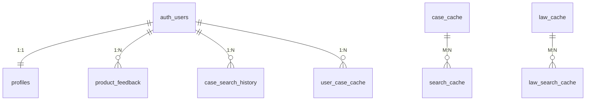

# Supabase 数据库表结构文档

> **版本**: v1.1  
> **最后更新**: 2025-12-22  
> **数据库**: Supabase (PostgreSQL)

---

## 目录

1. [数据库概览](#数据库概览)
2. [核心业务表](#核心业务表)
3. [搜索与缓存表](#搜索与缓存表)
4. [系统配置表](#系统配置表)
5. [表关系图](#表关系图)
6. [RLS 安全策略](#rls-安全策略)
7. [触发器与函数](#触发器与函数)
8. [Storage Buckets](#storage-buckets)

---

## 数据库概览

| 表名 | 描述 | RLS | 主要用途 |
|------|------|:---:|----------|
| `profiles` | 用户资料 | ✅ | 存储用户扩展信息（姓名、职位等） |
| `product_feedback` | 产品反馈 | ✅ | 收集用户反馈和问题建议 |
| `brand_settings` | 品牌设置 | ✅ | 动态管理系统 Logo、文案、主题色 |
| `search_filter_options` | 检索筛选项 | ✅ | 存储案例和法规检索的下拉过滤项 |
| `case_search_history` | 搜索历史 | ✅ | 记录用户的搜索词和参数 |
| `case_cache` | 案例缓存 | ✅ | 缓存从外部 API 获取的案例详细内容 |
| `law_cache` | 法律缓存 | ✅ | 缓存法律法规的正文内容 |
| `search_cache` | 搜索结果映射 | ✅ | 映射查询关键词与案例 ID 列表 |
| `law_search_cache` | 法规搜索缓存 | ✅ | 映射查询关键词与法规 ID 列表 |
| `user_case_cache` | 用户搜索分析 | ✅ | 存储 AI 提取的搜索关键词和参数 |
| `llm_prompts` | LLM 提示词 | ✅ | 管理 AI 交互所需的模型配置和提示词 |
| `search_suggestions` | 搜索建议 | ✅ | 提供首页搜索框的快捷建议词 |

---

## 核心业务表

### 1. profiles（用户资料表）

| 字段名 | 类型 | 约束 | 默认值 | 描述 |
|--------|------|------|--------|------|
| `id` | UUID | PRIMARY KEY | - | 关联 auth.users |
| `full_name` | TEXT | - | - | 姓名 |
| `title` | TEXT | - | - | 职位 |
| `phone` | TEXT | - | - | 电话 |
| `department` | TEXT | - | - | 部门 |
| `location` | TEXT | - | - | 办公地点 |
| `bio` | TEXT | - | - | 个人简介 |
| `avatar_url` | TEXT | - | - | 头像 URL |
| `theme` | TEXT | - | 'light' | 主题偏好 |
| `language` | TEXT | - | 'zh-CN' | 语言设置 |
| `created_at` | TIMESTAMPTZ | - | now() | 创建时间 |
| `updated_at` | TIMESTAMPTZ | - | now() | 更新时间 |

### 2. product_feedback（反馈表）

| 字段名 | 类型 | 描述 |
|--------|------|------|
| `id` | UUID | 主键 |
| `user_id` | UUID | 提交用户 |
| `type` | TEXT | bug, feature, improvement, other |
| `title` | TEXT | 标题 |
| `description` | TEXT | 详细描述 |
| `status` | TEXT | pending, in_progress, resolved, closed |
| `priority` | TEXT | low, medium, high, urgent |

---

## 搜索与缓存表

### 3. case_cache（案例详情缓存）

| 字段名 | 类型 | 描述 |
|--------|------|------|
| `case_id` | TEXT | 外部 API 的案例 ID |
| `case_title` | TEXT | 标题 |
| `case_no` | TEXT | 案号 |
| `court_name` | TEXT | 法院 |
| `trial_date` | DATE | 裁判日期 |
| `full_text` | TEXT | 判决书全文 |
| `related_laws` | JSONB | 引用法规列表 |

### 4. search_cache（搜索结果缓存）

| 字段名 | 类型 | 描述 |
|--------|------|------|
| `query_hash` | TEXT | 查询参数的 Hash 值 |
| `query` | TEXT | 原始查询词 |
| `case_ids` | TEXT[] | 匹配的案例 ID 列表 |
| `total_count` | INTEGER | 结果总数 |
| `expires_at` | TIMESTAMPTZ | 过期时间（通常 24h） |

---

## 系统配置表

### 5. llm_prompts（提示词管理）

| 字段名 | 类型 | 描述 |
|--------|------|------|
| `prompt_key` | VARCHAR | 唯一标识（如 search_agent） |
| `model_name` | VARCHAR | 使用的模型（如 deepseek-chat） |
| `system_prompt` | TEXT | 系统级指令 |
| `user_template` | TEXT | 用户输入模板 |
| `model_config` | JSONB | 温度、Top_P 等参数 |

---

## 表关系图

---

## RLS 安全策略

### 数据访问原则
- **用户私有**: `profiles`, `case_search_history`, `user_case_cache`, `product_feedback` 仅限用户本人访问。
- **公共只读**: `brand_settings`, `search_filter_options`, `search_suggestions` 所有人可读。
- **系统只读**: `llm_prompts` 仅限后端服务调用（或只读）。

---

## Storage Buckets

### avatars
- **目的**: 存储用户头像轮廓。
- **策略**: `auth.uid() = foldername` 用户只能上传到自己的文件夹。

---

**文档维护**: Alpha&Leader Legal Tech  
**同步自**: Supabase MCP Tools  
**最后更新**: 2025-12-22
