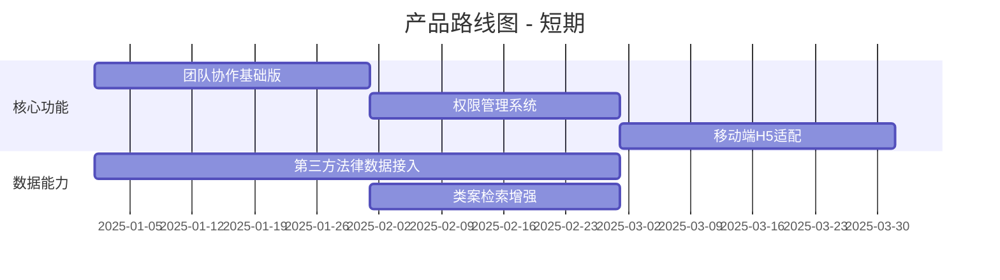

# AI法律助手 - 竞品调研报告

> **文档版本**: v1.0 | **更新日期**: 2025-12-09 | **产品版本**: v3.2

---

## 📊 行业背景

中国法律科技市场正在迅速发展，预计到2025年市场规模将突破**100亿元人民币**，年复合增长率超过**30%**。AI和大数据技术是推动法律服务行业变革的核心驱动力，传统法律服务面临人力成本高、效率瓶颈和标准化不足等痛点。

---

## 🎯 核心竞品分析

### 1. Alpha法律 / iCourt

| 维度 | 详情 |
|------|------|
| **用户规模** | 20万法律人，1.5万家律师事务所 |
| **产品定位** | 综合性法律智能操作系统 |
| **核心特色** | 法律数据库 + 案件管理 + AI工具 + 律所管理一体化 |

**主要功能**:
- 案件/客户/文档/工时/日程/知识管理
- 1.5亿+ 裁判文书，300万+ 法律法规
- AlphaGPT：合同审查、文书起草、法律咨询
- 多平台支持（网页、客户端、小程序、移动端）
- ISO 27001 / 等保三级认证

---

### 2. 案件云

| 维度 | 详情 |
|------|------|
| **定位** | 精品型案件管理软件 |
| **特色** | AI智能填充、语音创建日程、在线协作 |
| **部署** | 支持私有化部署 |

---

### 3. 元典律师工作站

| 维度 | 详情 |
|------|------|
| **定位** | 律所数字化转型工具 |
| **特色** | AI + 大数据分析，多维日历 |
| **功能** | 案件/文档/客户/协同/工时/知识管理 |

---

### 4. 律呗

| 维度 | 详情 |
|------|------|
| **定位** | 智能案件管理与协同办公 |
| **特色** | 案情智能分析、文稿拟写、风险预警 |
| **功能** | 全景视图、模板库、电子卷宗 |

---

## ⚖️ 功能对比矩阵

| 功能模块 | **本产品** | Alpha/iCourt | 案件云 | 元典 | 律呗 |
|----------|:----------:|:------------:|:------:|:----:|:----:|
| **案件管理** | ✅ | ✅ | ✅ | ✅ | ✅ |
| **多当事人支持** | ✅ | ✅ | ✅ | ✅ | ✅ |
| **证据管理** | ✅ | ✅ | ✅ | ✅ | ✅ |
| **AI智能分析** | ✅ | ✅ | ✅ | ✅ | ✅ |
| **胜诉率预测** | ✅ | ✅ | ❌ | ❌ | ❌ |
| **AI对话助手** | ✅ | ✅ | ✅ | ❌ | ❌ |
| **关系图谱可视化** | ✅ | ✅ | ❌ | ❌ | ❌ |
| **案件时间轴** | ✅ | ✅ | ❌ | ✅ | ❌ |
| **法律检索** | ✅ | ✅✅ | ❌ | ✅ | ❌ |
| **合同审查** | ✅ | ✅ | ❌ | ❌ | ❌ |
| **文书生成** | ✅ | ✅ | ❌ | ❌ | ✅ |
| **工时统计** | ⚠️ 基础 | ✅ | ✅ | ✅ | ✅ |
| **团队协作** | ❌ 规划中 | ✅ | ✅ | ✅ | ✅ |
| **移动端App** | ❌ 规划中 | ✅ | ✅ | ✅ | ✅ |
| **私有化部署** | ❌ 规划中 | ✅ | ✅ | ✅ | ❌ |
| **利冲检索** | ❌ | ✅ | ❌ | ❌ | ❌ |
| **律所财务管理** | ❌ | ✅ | ❌ | ✅ | ✅ |

> **图例**: ✅ 已实现 | ⚠️ 部分实现 | ❌ 未实现 | ✅✅ 行业领先

---

## 💪 本产品优势

### 1. 🎨 差异化视觉设计
- **黑白简洁主题**：专业、现代，区别于传统蓝色系法律软件
- **一致性设计系统**：统一的组件库和交互规范
- **用户体验优先**：两列布局减少滚动，分区编辑模态框降低认知负担

### 2. 🤖 AI功能深度集成
- **胜诉率预测**：可视化展示，竞品中少见
- **AI对话助手**：基于案件上下文的智能问答
- **关系洞察**：D3.js驱动的交互式关系图谱
- **证据分析规划**：AI评估证据完整度和优先级

### 3. 🛠️ 技术架构灵活
- **轻量级部署**：Vue 3 CDN版本，无需复杂构建
- **Supabase集成**：现代化BaaS，快速迭代
- **开源友好**：MIT协议，可自由定制

### 4. 💰 成本优势
- **透明定价**：相比Alpha（定制定价），成本可控
- **免费起步**：基础功能免费使用

---

## ⚠️ 本产品劣势

### 1. 📊 数据规模差距
| 维度 | 本产品 | Alpha/iCourt |
|------|--------|--------------|
| 裁判文书 | 无自有数据库 | 1.5亿+ |
| 法律法规 | 依赖外部数据 | 300万+ |
| 检索维度 | 基础筛选 | 24项高级维度 |

**建议**：接入第三方法律数据API（如OpenLaw、威科等）

### 2. 🏢 企业级功能缺失

| 缺失功能 | 优先级 | 竞品覆盖率 |
|----------|:------:|:----------:|
| 团队协作 | 🔴 高 | 80% |
| 权限管理 | 🔴 高 | 90% |
| 利冲检索 | 🟡 中 | 40% |
| 律所财务 | 🟡 中 | 60% |
| 审批流程 | 🟡 中 | 70% |

### 3. 📱 终端覆盖不足
- **无移动端**：竞品普遍支持iOS/Android
- **无离线模式**：依赖网络连接
- **无桌面客户端**：仅Web端

### 4. 🔐 安全认证待完善
- 无等保认证
- 无ISO 27001认证
- 企业客户信任度受限

---

## 📈 改进建议

### 短期优先 (v3.3 - v3.5)

1. **团队协作** - 案件共享、任务分配、实时协作
2. **权限管理** - 角色权限、数据隔离
3. **移动端适配** - 响应式设计或H5版本
4. **法律数据接入** - 整合外部法律数据库API

### 中期规划 (v4.0+)

| 功能 | 预期价值 | 复杂度 |
|------|----------|:------:|
| 原生移动App | 提升用户粘性 | 高 |
| 私有化部署 | 拓展企业客户 | 高 |
| 利冲检索 | 合规必备 | 中 |
| 工时计费完善 | 收入来源 | 中 |
| 等保认证 | 信任背书 | 高 |

---

## 🎯 差异化策略建议

### 1. 聚焦细分市场
- **目标用户**：中小律所、个人执业律师、企业法务
- **差异点**：性价比高、上手快、AI功能开箱即用

### 2. 强化AI特色
- 深化胜诉率预测准确度
- 增加智能风险预警
- 打造"AI法律助手"品牌心智

### 3. 建立生态壁垒
- 模板市场：法律文书模板共享
- 开发者生态：插件/扩展机制
- 社区运营：用户反馈驱动迭代

---

## 📋 总结

| 维度 | 评分 | 说明 |
|------|:----:|------|
| 核心功能完备度 | ⭐⭐⭐⭐ | 案件管理+AI分析已成熟 |
| AI智能化水平 | ⭐⭐⭐⭐⭐ | 胜诉率预测、关系图谱领先 |
| 数据能力 | ⭐⭐ | 缺乏自有法律数据库 |
| 企业级特性 | ⭐⭐ | 缺少团队协作、权限管理 |
| 终端覆盖 | ⭐⭐ | 仅Web端 |
| 用户体验 | ⭐⭐⭐⭐⭐ | 设计精良、交互流畅 |
| 成本效益 | ⭐⭐⭐⭐⭐ | 高性价比 |

> **结论**：产品在AI功能和用户体验上具有竞争力，但需补齐团队协作、移动端和数据能力短板，以拓展中大型客户市场。

---

**编写团队**: Alpha&Leader Legal Tech  
**文档状态**: 正式版